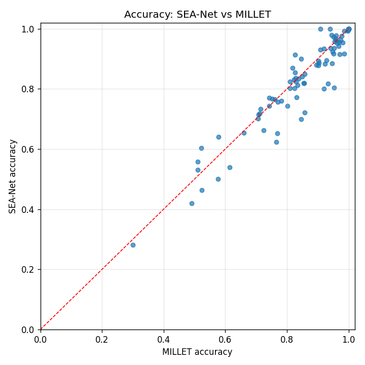
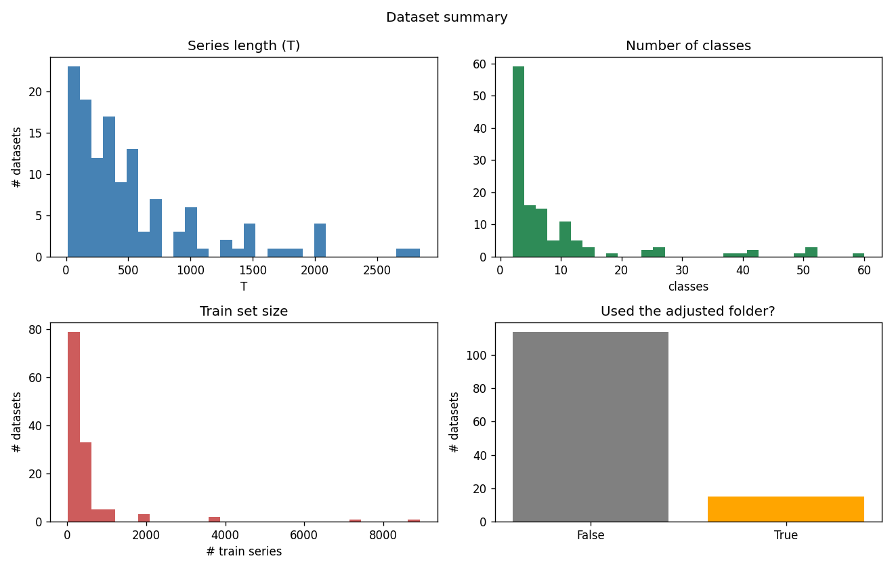
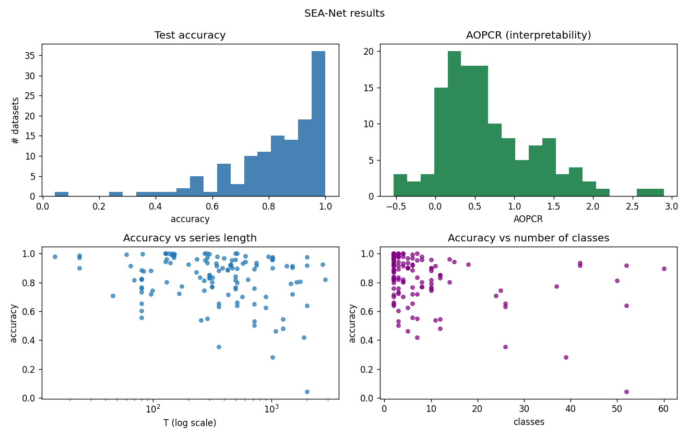

# SEA-Net

An updated, interpretable extension of the MILLET paper:
**"Inherently Interpretable Time Series Classification via Multiple Instance Learning"**
(original code: <https://github.com/JAEarly/MILTimeSeriesClassification>).

The original paper (MILLET) treats each time series as a **bag** of timesteps (Multiple Instance
Learning) and builds a model out of an **InceptionTime** feature extractor + a **Conjunctive**
pooling head. It is interpretable because the pooling head gives an importance score to every
timestep, not just a single class prediction.

**SEA-Net keeps the same idea but swaps the feature extractor.** Instead of InceptionTime we use a
small **Multi-Scale Separable** encoder, and we keep MILLET's **Additive** pooling head (reused
unchanged). The goal was a model that is **smaller**, at least **as accurate**, and **as
interpretable** as the MILLET baseline.

---

## Results

### WebTraffic (the only dataset with per-timestep ground truth, so NDCG@n is defined here)

MILLET's model (InceptionTime + Conjunctive), test split:

| Split | Accuracy | AUROC | Loss  | AOPCR  | NDCG@n |
| ----- | -------- | ----- | ----- | ------ | ------ |
| Test  | 0.922    | 0.994 | 0.393 | 12.483 | 0.675  |

SEA-Net (Multi-Scale Separable + Additive), test split:

| metric   | SEA-Net | MILLET | better?    |
| -------- | ------- | ------ | ---------- |
| accuracy | 0.958   | 0.922  | ✅ SEA-Net |
| AUROC    | 0.9977  | 0.994  | ✅ SEA-Net |
| loss     | 0.229   | 0.393  | ✅ SEA-Net |
| NDCG@n   | 0.7133  | 0.675  | ✅ SEA-Net |
| AOPCR    | 1.473   | 12.483 | ❌ MILLET  |

Two of these deserve a note, because they measure interpretability in **different** ways:

- **NDCG@n went up (0.675 → 0.713).** NDCG@n compares the model's per-timestep importance against
  the **true** important timepoints (the ground-truth labels WebTraffic ships). A higher value
  means SEA-Net's explanation lines up better with what is really going on. This is the metric that
  uses the truth, so we trust it most, and SEA-Net wins it.
- **AOPCR went down (12.483 → 1.473).** AOPCR does **not** use the ground truth. It deletes the
  model's own top-ranked timesteps and measures how far the model's prediction drops. A big drop
  means the model was leaning very hard on just a few points. SEA-Net spreads its evidence more
  evenly, so removing its top points hurts it less, which is why its AOPCR is smaller. So this is a
  self-consistency score, not an accuracy-of-explanation score, and it is the one place MILLET is
  stronger.

### Model size (fewer parameters is the point)

| model                       | params (n_clz=10) | state_dict MB |
| --------------------------- | ----------------- | ------------- |
| **SEA-Net**                 | **269,083**       | 3.54          |
| InceptionTime + Conjunctive | 423,707           | 4.11          |
| **SEA-Net / baseline**      | **63.5 %**        | 86 %          |

SEA-Net uses about **36 % fewer parameters** than the MILLET baseline. (The MB ratio is only 86 %
because both models share a fixed positional-encoding buffer, which is a big chunk of the saved
file but not a trainable weight.)

### Full UCR sweep (WebTraffic + 128 UCR datasets)

```
datasets with results : 129
mean test accuracy    : 0.8296
mean AOPCR            : 0.6585
params / size MB      : 269083 / 3.539
```

### Figures

All figures are produced by `analysis.ipynb` and saved under `results/SEA_NET/figures/`.

**Accuracy: SEA-Net vs MILLET** — every dot is one dataset; a dot **above the red line = SEA-Net
wins** on that dataset.



**Dataset summary** (sizes, series length, number of classes across the archive):



**Our results** (accuracy / AOPCR distributions across the sweep):



---

## What we reuse and what we change

The pipeline has four stages: **data → model → train → results**. Below is exactly what came
straight from MILLET and what is new in SEA-Net.

### 1. Data — `seanet/data.py` (mostly reused)

- **Reused:** MILLET's `UCRDataset`, `WebTrafficDataset`, and the base `MILTSCDataset` (which does
  the z-normalisation). We do not re-implement loading or normalisation.
- **New:** one entry point, `load_dataset(name, split)`, so the whole project loads any dataset
  (WebTraffic or any of the 128 UCR) the same way, by name.
- **Change (routing only, no MILLET edit):** 15 UCR datasets have missing values or variable-length
  series, so their **raw** files contain `NaN`, which would break normalisation. The UCR archive
  ships pre-fixed copies of those 15 in a special folder. `AdjustedUCRDataset` subclasses MILLET's
  `UCRDataset` and reads from that folder for those 15 names only. Everything else is untouched.
  (See `AdjustedUCRDataset` and `ucr_tsv_path` in `seanet/data.py`.)
- **New helper:** `read_our_csv()` reads our own csv files tolerantly, because a tool on the build
  machine keeps padding csv columns with spaces.

### 2. Model — `seanet/model.py` (encoder is new, pooling is reused)

- **New (the "SEA" part):** `MSTCNSepEncoder`, built from `MultiScaleSepBlock`. Each block runs
  three kernel sizes (5 / 11 / 23) in parallel and adds them (multi-scale), uses depthwise-separable
  convolutions (few weights → small model), grows the dilation 1,2,4,8,16 but caps it at 16 (keeps
  each timestep's view local, which keeps the importance scores honest), and zero-pads so the series
  length T never changes.
- **Reused:** MILLET's `MILAdditivePooling` head, used as-is. It turns the encoder's per-timestep
  features into (a) a class prediction, (b) a per-timestep importance vector (the interpretation),
  and (c) an attention gate.
- **Glue:** `EncoderPoolNet` just wires "encoder → pooling head" together. `make_sea_net()` builds
  SEA-Net; `make_baseline()` builds MILLET's InceptionTime + Conjunctive model for comparison.

### 3. Train — `seanet/train.py` (reused loop, one new penalty)

- **Reused:** MILLET's `MILLETModel` training/evaluation machinery (loss, dataloaders, the AOPCR /
  NDCG interpretability metrics).
- **New:** `SeaNetModel` subclasses `MILLETModel` and adds a small **attention-entropy penalty**
  (λ = 0.01) to the loss, which nudges the attention gate to focus on fewer timesteps.
- **New robustness:** a validation split for early stopping (stratified 80/20 when there are enough
  training series, otherwise train-loss), label smoothing, and `safe_evaluate()` which falls back
  to `AUROC = NaN` when a test split is missing a class (which would otherwise crash `roc_auc_score`).
- **Windows fix:** `get_device()` replaces MILLET's GPU picker, which raises on Windows.

### 4. Results — `seanet/results.py` (all new bookkeeping)

- Every finished dataset appends one row to `results.csv` and its name to `done.txt`.
- **Resumable:** a long sweep can stop and restart; `result_exists()` checks `done.txt` and skips
  anything already done. `done.txt` is plain text (the csv-padding tool leaves it alone) and
  `results.csv` is append-only, so a run can't corrupt itself mid-write.
- `build_comparison()` joins our UCR numbers to the MILLET paper's published numbers
  (`results/UCR/InceptionTime/`, the 5-rep Conjunctive baseline) and labels each dataset
  win / tie / loss on accuracy and AOPCR.

---

## Getting the data

The datasets are **not** included in this repo (they are large and have their own licenses), so you
download them once and place them under `data/`. The code checks what is on disk and tells you
clearly if anything is missing.

### WebTraffic (synthetic, ~19 MB)

This is MILLET's synthetic dataset. Copy its four files from the original MILLET repo
([`data/WebTraffic/`](https://github.com/JAEarly/MILTimeSeriesClassification/tree/master/data/WebTraffic))
into `data/WebTraffic/` here:

```
data/WebTraffic/
  WebTraffic_TRAIN.csv
  WebTraffic_TEST.csv
  WebTraffic_TRAIN_metadata.json
  WebTraffic_TEST_metadata.json
```

### UCR archive (128 datasets, ~260 MB zipped)

Download `UCRArchive_2018.zip` from the official UCR page and unzip it into `data/UCR/`:

- Archive page: <https://www.cs.ucr.edu/~eamonn/time_series_data_2018/>
- Direct link: <https://www.cs.ucr.edu/~eamonn/time_series_data_2018/UCRArchive_2018.zip>

The zip is **password-protected**; the password is given in the archive's briefing document
([BriefingDocument2018.pdf](https://www.cs.ucr.edu/~eamonn/time_series_data_2018/BriefingDocument2018.pdf))
on that page. After unzipping, `data/UCR/` should contain one folder per dataset, e.g.:

```
data/UCR/
  Coffee/Coffee_TRAIN.tsv, Coffee_TEST.tsv
  ECG200/...
  ...
  Missing_value_and_variable_length_datasets_adjusted/   <- keep this folder; the 15 fixed datasets live here
```

Keep the `Missing_value_and_variable_length_datasets_adjusted/` folder — it holds the cleaned copies
of the 15 problem datasets (see [Adjustments to the MILLET code](#adjustments-to-the-millet-code)).

---

## How to run

Everything runs through `main.py`:

```bash
python main.py summary            # quick WebTraffic + Coffee data demo
python main.py summary --all      # summarise WebTraffic + all 128 UCR -> data_summary.csv
python main.py params             # print SEA-Net vs baseline parameter counts
python main.py webtraffic         # train on WebTraffic + compare to MILLET
python main.py single Coffee      # train + evaluate one dataset, save its result
python main.py train              # full sweep: WebTraffic + all 128 UCR (resumable)
python main.py results            # build + print the comparison vs MILLET
```

Add `--smoke` to any training command for a quick 3-epoch check.

`analysis.ipynb` is a read-only notebook that turns `data_summary.csv`, `results.csv`, and the
comparison into the figures above.

---

## Adjustments to the MILLET code

We kept MILLET's code as-is except for **two tiny fixes** that were needed to make the
interpretability evaluation and the imports run on this setup:

1. `millet/model/millet_model.py` — the interpretability evaluation crashed on every UCR dataset
   because it checked `if "instance_targets" in batch` (a key that is always present but set to
   `None`). Changed to `if batch.get("instance_targets") is not None:`.
2. `millet/data/web_traffic_dataset.py` — removed a cosmetic `@override` decorator and its
   `from overrides import override` import (the `overrides` package is not installed and the
   decorator does nothing at runtime). Also dropped `overrides` from `requirements.txt`.

The NaN / variable-length handling for the 15 problem datasets is **not** a MILLET edit — it is done
by subclassing in `seanet/data.py` and reading the UCR archive's own pre-fixed copies.
