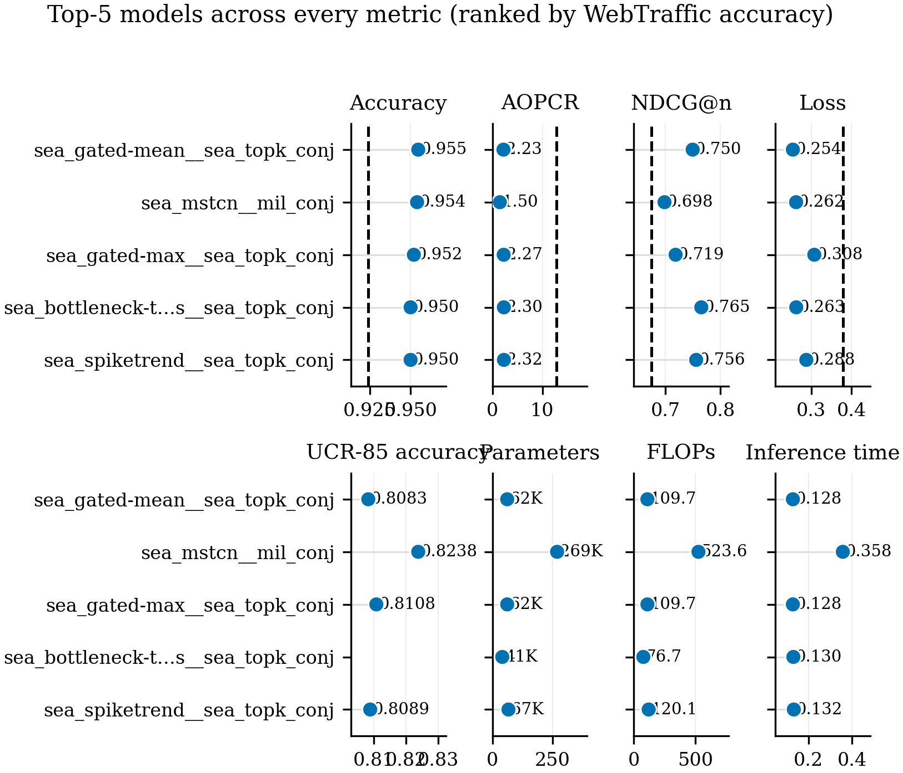
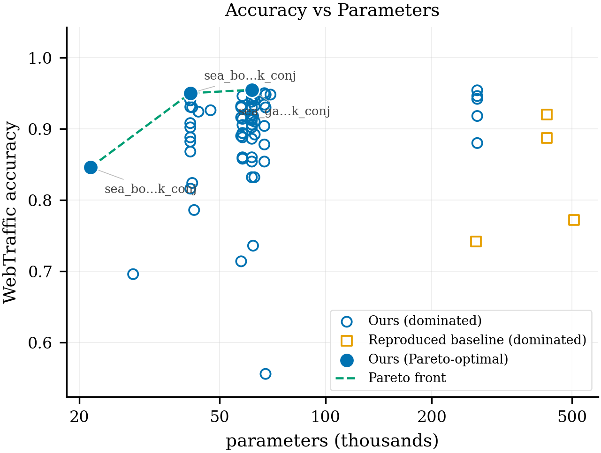
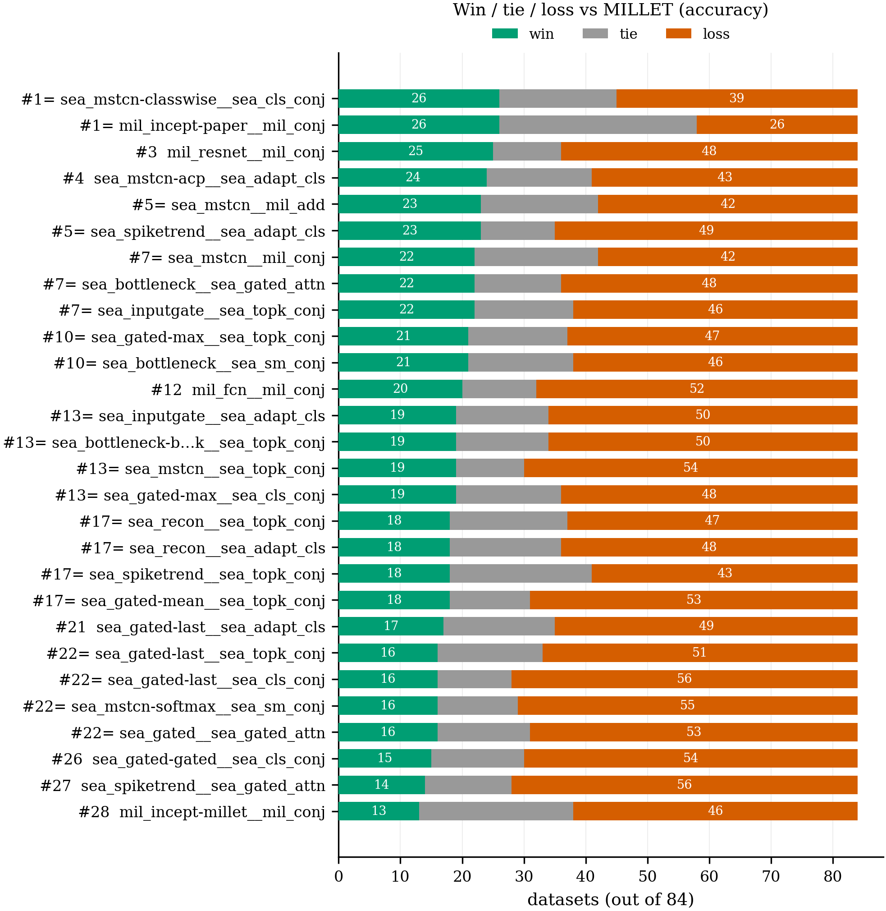
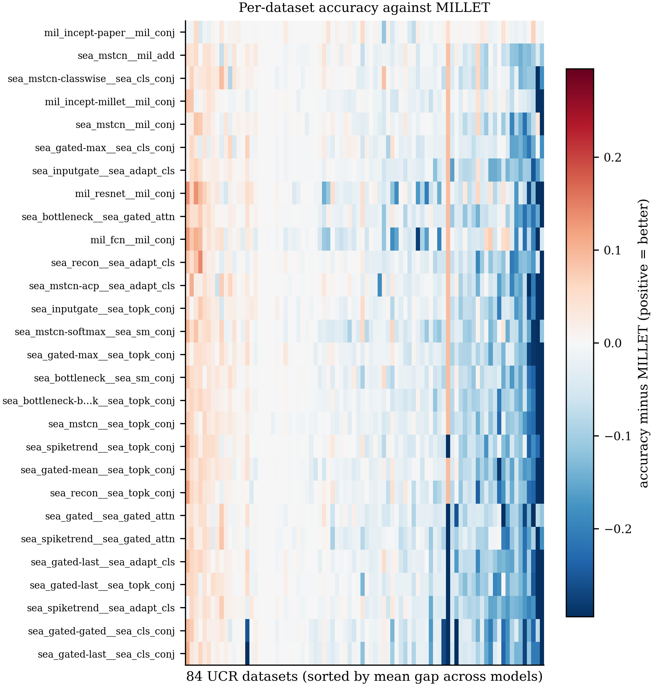
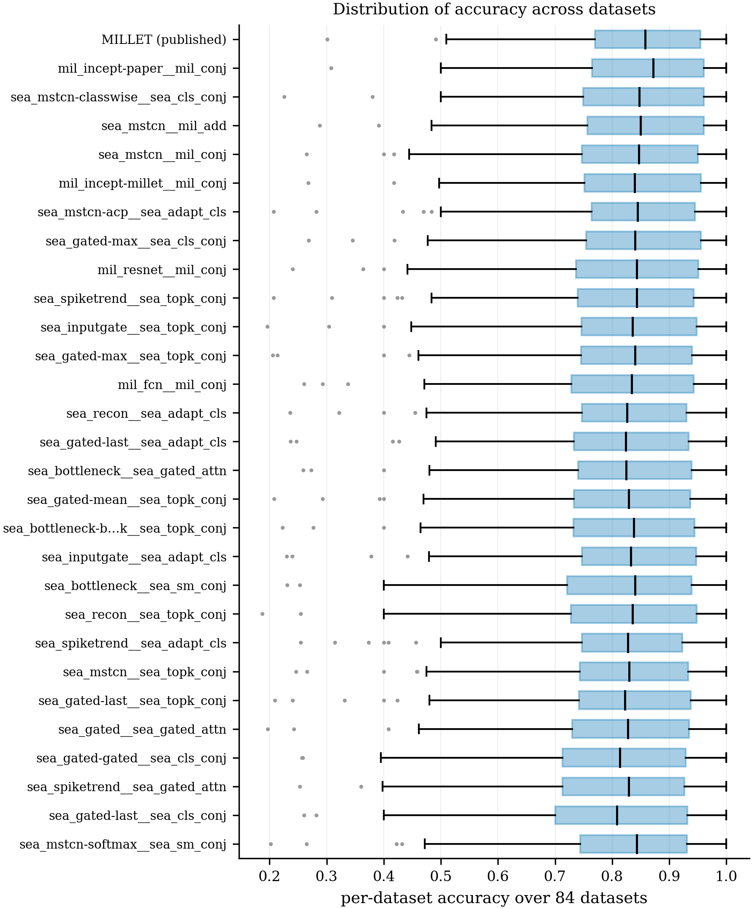
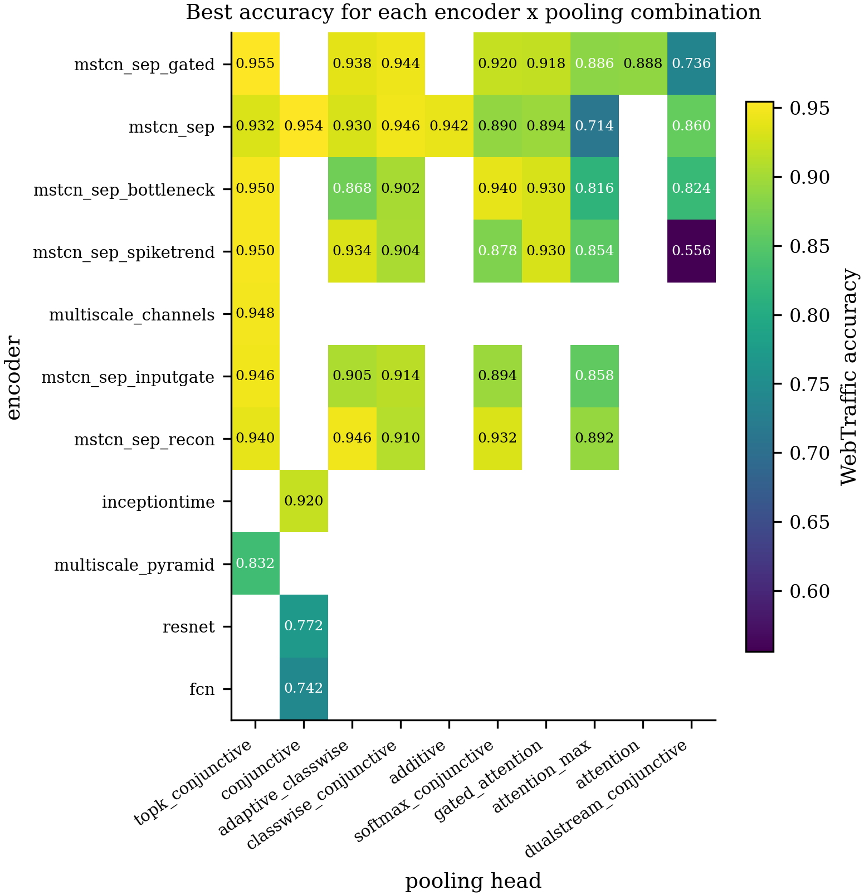

# SEA-Net

**A small time-series classifier that also shows its reasons.**

SEA-Net does not only predict a label — it also says **which timesteps** made it choose that label.
It follows the MILLET idea
([*Inherently Interpretable Time Series Classification via Multiple Instance Learning*](https://github.com/JAEarly/MILTimeSeriesClassification)):
one series is a **bag**, each timestep is an **instance**, and the model produces a per-timestep
importance map *at the same time* as its prediction. The explanation is not a second model bolted on
afterwards, so it can never disagree with the prediction.

The question the project asks:

> **Can a much smaller model match or beat MILLET on accuracy *and* on the quality of its
> explanation at the same time?**

Datasets: **WebTraffic** (the headline set — the only one with per-timestep ground truth, so the
explanation itself can be scored) and the **UCR 2018 archive** (128 datasets, 85 of them with
published MILLET numbers to compare against).

**Status:** experiments are finished. **72 encoder × pooling-head combinations** were trained on
Grid'5000 GPU nodes and ranked in [`results/SEA_NET/leaderboard.csv`](results/SEA_NET/leaderboard.csv).
Nothing is running. Every figure and table below is regenerated by one command,
`python main.py analyse`.

---

## Table of contents

1. [Quick start](#quick-start)
2. [The idea in one picture](#the-idea-in-one-picture)
3. [How the code flows](#how-the-code-flows)
4. [The architecture](#the-architecture)
5. [Repository layout](#repository-layout)
6. [Commands](#commands)
7. [Results](#results)
8. [Ablations](#ablations)
9. [Further experiments](#further-experiments)
10. [Rebuilding every number](#rebuilding-every-number)
11. [Getting the data](#getting-the-data)
12. [Two run environments](#two-run-environments)
13. [What we reuse from MILLET](#what-we-reuse-from-millet)
14. [Documentation](#documentation)
15. [Licence](#licence)

---

## Quick start

```bash
conda create -n seanet python=3.10 -y && conda activate seanet
pip install torch                     # pick the right build for your machine: pytorch.org
pip install -r requirements.txt

python main.py models                                                  # what can I run?
python main.py single Coffee --model seanet_bottleneck_topk --smoke    # 3-epoch flow check
python main.py leaderboard                                             # the results that already exist
```

The datasets are **not** in git (they are large and have their own licences) — see
[Getting the data](#getting-the-data) and [`guide/02_datasets.md`](guide/02_datasets.md).

---

## The idea in one picture

```text
series (B, 1, T)
    -> ENCODER            (B, d, T)     seanet/models/encoders.py
    -> MIL POOLING HEAD                 seanet/models/pooling.py
         |-> bag_logits     (B, n_clz)    the prediction
         |-> interpretation (B, n_clz, T) the explanation  -> scored by AOPCR and NDCG@n
         `-> attn           (B, T, 1)     the attention gate (used by the training focus penalty)
```

`B` = batch, `T` = series length (**never** changes, so deleting a timestep — which AOPCR does —
never changes the shape), `d` = encoder width, `n_clz` = number of classes.

**The one design rule of this repo:** the encoder and the MIL pooling head are **independently
switchable**. Each is looked up by name in its own small registry, so any encoder pairs with any
head from configuration alone — no code change:

```yaml
encoder: {type: sea_mstcn_sep_bottleneck}   +  pooling: {type: sea_topk_conjunctive}
encoder: {type: mil_inceptiontime}          +  pooling: {type: sea_topk_conjunctive}
encoder: {type: sea_mstcn_sep_bottleneck}   +  pooling: {type: mil_conjunctive}
```

That is what makes the comparison fair: the MILLET baseline is not a number copied from the paper,
it is MILLET's own encoder and head trained **here**, with the same recipe, the same machine and the
same epochs as SEA-Net, with only the two parts swapped.

The classification head lives *inside* the pooling head on purpose: a MIL head has to score every
timestep before it aggregates, and that per-timestep score **is** the interpretation map.

---

## How the code flows

One module owns each step, and **`main.py` is the only file that knows the order**. Read `main.py`
top to bottom and you have read the whole pipeline — it orchestrates only: no model maths, no
training loop and no plotting live in it.

```text
configs/  ->  data  ->  preprocessing  ->  encoder  ->  MIL pooling  ->  training
                                                                            |
                        results / leaderboard / analysis  <-  evaluation  ->  MLflow
```

| step | what it does | file |
|---|---|---|
| configuration | read `main.yaml` + the environment file + the model file, merge them | `seanet/config.py` |
| data | load WebTraffic or any UCR dataset by name | `seanet/data.py` |
| preprocessing | z-normalise, stratified train/val split | `seanet/preprocessing.py` |
| encoder | `(B, 1, T) -> (B, d, T)` | `seanet/models/encoders.py` |
| MIL pooling | `(B, d, T) -> logits + interpretation + attention` | `seanet/models/pooling.py` |
| build | pair one encoder with one head | `seanet/models/build.py` |
| training | the one training loop, early stopping, the focus penalty | `seanet/training.py` |
| evaluation | score a trained model into one results row | `seanet/evaluation.py` |
| metrics | accuracy / balanced accuracy / AUROC / loss / AOPCR / NDCG@n | `seanet/metrics.py` |
| results | save rows, build the leaderboard, compare against MILLET | `seanet/results.py` |
| analysis | every cross-model figure and table | `seanet/analysis/` |
| tracking | MLflow (one experiment, everything else as tags) | `seanet/tracking.py` |
| optuna | optional hyperparameter search, same pipeline | `seanet/optuna_search.py` |

**Nothing about an experiment lives in the Python.** Configuration is split three ways:

| file | answers |
|---|---|
| `configs/main.yaml` | **what** to run (dataset, epochs, seed, batch size, what to save) |
| `configs/environments/{local,grid5000}.yaml` | **where** it runs (device, workers, paths, MLflow URI) |
| `configs/models/{baselines,seanet,ablations}/*.yaml` | **which model** (the encoder block + the pooling block) |

**Where the output goes.** Each model gets its own folder named
`<config name>__<encoder>__<pooling>`, so two configs that happen to build the same pair can never
mix their numbers up:

```text
results/SEA_NET/<model_id>/
    results.csv               one row per dataset PER SEED (an upsert: re-running replaces the row)
    done_train_dataset.txt    the resume list — "train" skips whatever is in here
    history/                  per-epoch train/val loss AND accuracy
    figures/  curves/  interpretation/  predictions/  logs/
results/SEA_NET/leaderboard.csv    every model, ranked by WebTraffic accuracy
results/analysis/                  the cross-model figures and tables (+ INDEX.md)
mlflow.db                          every run, browsable in the MLflow web page
```

**Resuming.** A long sweep is safe to Ctrl+C and restart: `done_train_dataset.txt` lists what is
finished and `train` skips it. Delete the file to retrain everything, or delete one line to retrain
just that dataset.

---

## The architecture

Three views, from the whole network down to a single block.

> The diagrams show the **wide** base encoder (`d = 128`, 6 blocks). The models in the results
> tables use the **narrow** setting (`d = 64`, 4 blocks) — same structure, fewer channels and blocks.

### Level 1 — the whole network


The series `(B, 1, T)` goes through the encoder to per-timestep features `(B, d, T)`, then the
pooling head produces the three outputs listed above.

### Level 2 — inside the encoder


A stem `Conv1d(1 -> d, k=7)` lifts the single channel to `d` channels, then residual blocks run with
dilations **1, 2, 4, 8, 16, 16** — capped at 16 on purpose, to keep each timestep's view local,
which is what keeps the importance scores honest. Zero "same" padding keeps the length `T` the same
all the way through.

### Level 3 — inside one block


Each block runs a unit **twice** and then adds the input back (residual). One unit runs three
**depthwise** convolutions with kernels **5 / 11 / 23** in parallel and **sums** them (this is the
"multi-scale" part), then a `1x1` pointwise conv mixes the channels, followed by
BatchNorm -> ReLU -> Dropout. Depthwise-separable convolutions use very few weights — this is the
whole reason SEA-Net is small.

### The encoders (`seanet/models/encoders.py`)

Naming rule: `sea_*` = written for this project, `mil_*` = reused from `millet/` unchanged.

| name | what it adds |
|---|---|
| `sea_mstcn_sep` | the plain multi-scale separable TCN (the original SEA-Net) |
| `sea_mstcn_sep_gated` | plus one summary gate on top |
| `sea_mstcn_sep_bottleneck` | the smallest one: the `d->d` 1x1 conv is factorised through `d->r->d` |
| `sea_mstcn_sep_spiketrend` | two branches (smooth trend + high-pass spike), mixed and gated |
| `sea_mstcn_sep_inputgate` | a gate read straight off the raw input |
| `sea_mstcn_sep_recon` | adds features built from the reconstruction residual |
| `sea_multiscale_channels` † | **wrapper**: adds rolling max/min/std channels to the input |
| `sea_multiscale_pyramid` † | **wrapper**: runs the same encoder at downsampling 1/2/4/8 and fuses back to length `T` |
| `mil_inceptiontime`, `mil_fcn`, `mil_resnet` | MILLET's own backbones, for the baselines |

† A wrapper does not replace an encoder, it wraps one — the wrapped encoder is nested under `base:`
in the config, so a wrapper works on top of **any** encoder above it.

### The MIL pooling heads (`seanet/models/pooling.py`)

Every head shares one template: `z_j -> attention branch` (slot 1) and `z_j -> per-step classifier`;
their product is the evidence `g_j^k`, and an aggregator over time (slot 2) turns the `T` evidence
values into the bag score. The interpretation **is** those same `g_j^k` values. So a head is fully
described by what it puts in the two slots:

| head | slot 1 — attention branch | slot 2 — how evidence is combined | reduces to the baseline when |
|---|---|---|---|
| `mil_conjunctive` *(MILLET, reused)* | one **shared** gate | plain mean over all `T` | — |
| `sea_classwise_conjunctive` | one gate **per class** | plain mean over all `T` | `a_j^k = a_j` |
| `sea_softmax_conjunctive` | per-class score -> `softmax_j(s/τ)`, sums to 1 | weighted sum; `τ` learns how peaked | `τ -> ∞` |
| `sea_adaptive_classwise` | per-class gate | `softmax_j(β_k g_j^k)`; `β` learns mean ↔ max **per class** | `β_k -> 0` |
| **`sea_topk_conjunctive`** | per-class gate | mean of the `k = ⌈κT⌉` largest; **the rest are dropped outright** | `κ = 1` |
| `sea_attention_max` | per-class gate | `(1−λ_k)·mean + λ_k·max` | `λ_k -> 0` |
| `sea_gated_attention` | `tanh(Vz) ⊙ σ(Uz)`, then per-class score + softmax | weighted sum | **never** — no safety net |
| `sea_dualstream_conjunctive` | per-class gate + a query compared with the critical step | blend of the mean stream and the critical-step stream | `λ -> 0` |

Only **Top-k** makes the interpretation *exactly zero* where the model used no evidence; every other
head leaves a small weight that never quite reaches zero. That is the mechanism behind its NDCG@n
advantage.

MILLET's `mil_additive`, `mil_attention`, `mil_instance` and `mil_gap` heads are also registered and
available.

---

## Repository layout

```text
main.py           the ONE entry point — read it to see the whole pipeline
configs/          main.yaml, environments/ (local, grid5000), models/ (baselines, seanet, ablations)
seanet/           our code (see the flow table above)
millet/           upstream MILLET, kept UNCHANGED so it stays diffable against the original repo
scripts/          profiling, ensembling, config generation, Grid5000 launchers
guide/            all the documentation (guide/README.md is the index)
results/          SEA_NET/ (per model) + analysis/ (cross-model) + UCR/, WebTraffic/ (MILLET's published)
data/             the datasets (not in git)
```

Two things are deliberately **not** committed:

| not here | why | how to get it |
|---|---|---|
| `data/` | UCR is ~300 MB with its own licence; WebTraffic belongs to MILLET | [Getting the data](#getting-the-data) |
| `model/`, `*.pth` | trained weights: large, and regenerated by training | `python main.py train --model <config>` |

Everything else needed to reproduce the numbers is committed: the code, every config, and the
per-dataset CSVs that each figure and table is built from.

---

## Commands

```bash
# cheap — these only READ results that already exist, safe to run any time
python main.py models          # list every config you can pass to --model
python main.py summary [NAME] [--all]   # dataset stats: length, classes, train/test sizes
python main.py params          # parameter counts: SEA-Net vs the baselines
python main.py results         # rebuild each model's comparison table vs MILLET
python main.py leaderboard     # one table of every model, best WebTraffic accuracy first
python main.py analyse         # every comparison figure + table -> results/analysis/
python main.py report          # the per-model figures -> results/SEA_NET/<model>/figures/
python main.py web-compare     # WebTraffic-only comparison, accuracy tiers, the winner

# expensive — these really train. Add --smoke for a 3-epoch flow check (never saved)
python main.py single NAME --model M     # ONE dataset, one row — use this while testing
python main.py train --model M           # EVERY dataset (WebTraffic + 128 UCR), resumable
python main.py webtraffic --model M      # WebTraffic only, then sanity-check against MILLET
python main.py interpret --model M       # train, then draw the per-sample explanation figures
python main.py optuna --model M          # hyperparameter search
```

Shared flags: `--model` (config under `configs/models/`, the folder is optional — both
`seanet/seanet_bottleneck_topk` and `seanet_bottleneck_topk` work), `--env` (`local` or `grid5000`),
`--seed` (a new seed **adds** a repeat row, it never overwrites seed 0), `--smoke`, `--limit`.

`python main.py -h` lists everything; `python main.py single -h` lists one command's flags.

---

## Results

All 72 models — ours **and** the baselines — were trained with the **same configuration**, so any
difference comes from the model and not from the recipe. Four models were re-run with **3 seeds**;
the rest are single-seed, and every table below says which.

Source of truth: [`results/SEA_NET/leaderboard.csv`](results/SEA_NET/leaderboard.csv).
Regenerate everything with `python main.py analyse`.

### Top 10 on WebTraffic

WebTraffic is the only dataset with per-timestep ground truth, so it is the only place where the
*explanation* can be scored against a known answer (NDCG@n). UCR-85 is the mean accuracy over the 85
datasets the MILLET paper reports; a dash means the model was screened on WebTraffic only.

| # | config | encoder | pooling | Acc. | AOPCR | NDCG@n | UCR-85 | Params | FLOPs (M) |
|---|---|---|---|---|---|---|---|---|---|
| 1 | `seanet_gated_mean_topk` | `sea_mstcn_sep_gated` | `sea_topk_conjunctive` | **0.955** | 2.23 | 0.750 | 0.8083 | 61,740 | 109.7 |
| 2 | `seanet_conjunctive` | `sea_mstcn_sep` | `mil_conjunctive` | 0.954 | 1.50 | 0.698 | 0.8238 | 269,083 | 523.6 |
| 3 | `seanet_gated_max_topk` | `sea_mstcn_sep_gated` | `sea_topk_conjunctive` | 0.952 | 2.27 | 0.719 | 0.8108 | 61,740 | 109.7 |
| 4 | `seanet_topk_nofocus` | `sea_mstcn_sep_bottleneck` | `sea_topk_conjunctive` | 0.950 | 2.30 | 0.765 | — | **41,324** | **76.7** |
| 5 | `seanet_spiketrend_topk` | `sea_mstcn_sep_spiketrend` | `sea_topk_conjunctive` | 0.950 | 2.32 | 0.756 | 0.8089 | 67,020 | 120.1 |
| 6 | `seanet_inputgate_mschan` | `sea_multiscale_channels` | `sea_topk_conjunctive` | 0.948 | 2.32 | 0.757 | — | 69,768 | 134.1 |
| 7 | `seanet_gated_mschan` | `sea_multiscale_channels` | `sea_topk_conjunctive` | 0.948 | 2.22 | 0.717 | — | 67,592 | 121.5 |
| 8 | `seanet_recon_adaptive` | `sea_mstcn_sep_recon` | `sea_adaptive_classwise` | 0.946 | 2.60 | **0.768** | 0.8140 | 62,935 | 120.3 |
| 9 | `seanet_classwise` | `sea_mstcn_sep` | `sea_classwise_conjunctive` | 0.946 | 1.72 | 0.686 | **0.8292** | 269,164 | 523.7 |
| 10 | `seanet_inputgate_topk` | `sea_mstcn_sep_inputgate` | `sea_topk_conjunctive` | 0.946 | **2.80** | 0.748 | 0.8131 | 58,092 | 110.6 |

The full 72-row table is
[`results/analysis/tables/table_appendix_full_leaderboard.md`](results/analysis/tables/table_appendix_full_leaderboard.md).





### The head-to-head that carries the argument

`seanet_bottleneck_topk` against the re-trained MILLET baseline, WebTraffic, **mean ± std over
3 seeds**:

| | `seanet_bottleneck_topk` | `millet` (re-trained here) | |
|---|---|---|---|
| Accuracy | **0.931 ± 0.040** | 0.887 ± 0.010 | SEA-Net wins |
| NDCG@n | **0.765 ± 0.015** | 0.677 ± 0.016 | SEA-Net wins |
| AOPCR | 2.498 ± 0.182 | 2.569 ± 0.884 | a tie — far inside MILLET's own seed spread |
| Parameters | **41,324** | 423,707 | **90 % fewer** |
| FLOPs | **76.7 M** | 847.6 M | **11x fewer** |
| Model size | **1.43 MB** | 4.11 MB | |
| 1 prediction | 0.131 ms | 0.203 ms | |

So the honest headline is: **the same accuracy or better, a clearly better explanation ranking
(NDCG@n), a tie on AOPCR, at one tenth of the size.** Per-seed accuracies:

| model | seed 0 | seed 1 | seed 2 | mean ± std |
|---|---|---|---|---|
| `seanet_gated_mean_topk` | 0.954 | 0.958 | 0.952 | 0.955 ± 0.003 |
| `seanet_bottleneck_topk` | 0.888 | 0.938 | 0.966 | 0.931 ± 0.040 |
| `seanet_inputgate_adaptive` | 0.938 | 0.880 | 0.898 | 0.905 ± 0.030 |
| `millet` (re-trained here) | 0.894 | 0.876 | 0.892 | 0.887 ± 0.010 |

The rule we apply everywhere: **a difference smaller than the seed spread is not a result.**

### Two things the numbers do *not* say

**1. On the full UCR archive MILLET is still ahead.** Our headline models were picked because they
did well on WebTraffic, and one dataset does not predict 85. Mean rank is over the 84 datasets
shared by the 28 models that finished the archive (lower is better); W/T/L is against the
**published** MILLET numbers, ties within 0.005.

| model | UCR-85 accuracy | mean rank | W/T/L vs published |
|---|---|---|---|
| `millet_paper` — MILLET architecture, MILLET's own recipe | **0.8434** | **9.41** | **26 / 32 / 26** |
| `seanet_classwise` | 0.8292 | 11.53 | 26 / 19 / 39 |
| `millet` — the same architecture, our recipe | 0.8274 | 12.60 | 13 / 25 / 46 |
| `resnet` | 0.8146 | 13.54 | 25 / 11 / 48 |
| `fcn` | 0.8141 | 14.48 | 20 / 12 / 52 |
| `seanet_inputgate_adaptive` | 0.8153 | 15.47 | 19 / 15 / 50 |
| `seanet_bottleneck_topk` | 0.8097 | 15.40 | 19 / 15 / 50 |
| `seanet_gated_mean_topk` | 0.8083 | 15.29 | 18 / 13 / 53 |
| *MILLET, published* | *0.8445* | — | — |

The first and third rows are the **same architecture and the same code**, trained twice under two
configurations. Under MILLET's own long recipe our harness reaches **0.8434 against a published
0.8445** — a reproduction, not an approximation. So the shortfall is the **training budget**, never
the re-implementation, and our models should be compared against the **0.8274** row.

**2. AOPCR is unnormalised, so never compare it across papers.** The same architecture scores
**2.57** under our recipe and **13.27** under MILLET's longer one. Only compare AOPCR between models
trained the same way.

### Where the wins and losses come from

**Win / tie / loss against the published MILLET results**, per dataset, over the 84 datasets both
report:



Wins and losses are spread across the whole archive rather than concentrated in a few datasets, so
the near-balanced record is real and not an artefact of how ties are counted.

**Dataset x model heatmap** — columns are datasets, rows are models. Most of the structure is
*vertical*, which says the **dataset** matters more than the model on this archive:



**Accuracy against series length.** On `seanet_bottleneck_topk` over all 128 UCR datasets, the
correlation between accuracy and series length is **-0.34**. Splitting the archive at the median
length (344 steps), the shorter half averages **0.857** and the longer half **0.755** — a gap far
larger than any seed spread we measured.

This is a real limitation and it matches the mechanism: `max_dilation` is 16 in every SEA-Net
config, so the receptive field stops growing after a fixed reach and later blocks work from an
increasingly incomplete view on long series. **Making the dilation cap depend on the series length
is the obvious next experiment.**



### Every other figure and table

`results/analysis/` holds the whole set, grouped by the question each figure answers. Start at
[`results/analysis/INDEX.md`](results/analysis/INDEX.md):

| folder | what is in it |
|---|---|
| `01_leaderboard/` | the benchmark bars, the Pareto front, the top-5 multi-metric panel |
| `02_ablation/` | encoder alone, pooling alone, origin, and the encoder x pooling grid |
| `03_detail/` | the complete field on each metric, all four Pareto views, the heatmap |
| `04_webtraffic/` | the WebTraffic top-10 on accuracy / AOPCR / NDCG@n / loss |
| `05_statistics/` | average rank, pairwise wins, improvement over MILLET, metric correlation |
| `tables/` | the five tables, each written twice as `.csv` (exact) and `.md` (readable) |

---

## Ablations

### Which half matters — the encoder or the head?

Means over every model that uses each part, on WebTraffic. `n` is how many models are in the group.

**By pooling head:**

| pooling head | mean acc. | mean AOPCR | mean NDCG@n | n |
|---|---|---|---|---|
| `sea_classwise_conjunctive` | 0.921 | 2.32 | 0.692 | 10 |
| `sea_gated_attention` | 0.918 | 1.87 | 0.733 | 4 |
| `sea_adaptive_classwise` | 0.912 | 2.21 | 0.732 | 9 |
| `sea_softmax_conjunctive` | 0.907 | 1.69 | 0.712 | 9 |
| `sea_topk_conjunctive` | 0.906 | 2.33 | 0.717 | 21 |
| `sea_attention_max` | 0.838 | 1.76 | 0.645 | 8 |
| `sea_dualstream_conjunctive` | 0.744 | 2.01 | 0.636 | 4 |
| *`mil_additive`* | *0.942* | *1.58* | *0.729* | *1* |
| *`mil_attention`* | *0.888* | *2.40* | *0.710* | *1* |
| *`mil_conjunctive`* | *0.855* | *4.82* | *0.625* | *5* |

**By encoder** (`†` = wrapper, not an encoder):

| encoder | mean acc. | mean AOPCR | mean NDCG@n | n |
|---|---|---|---|---|
| `sea_multiscale_channels` † | 0.936 | 2.39 | 0.747 | 4 |
| `sea_mstcn_sep_recon` | 0.924 | 2.32 | 0.719 | 5 |
| `sea_mstcn_sep_inputgate` | 0.903 | 2.35 | 0.718 | 5 |
| `sea_mstcn_sep_gated` | 0.902 | 2.06 | 0.710 | 19 |
| `sea_mstcn_sep` | 0.898 | 1.93 | 0.693 | 12 |
| `sea_mstcn_sep_bottleneck` | 0.894 | 2.33 | 0.709 | 13 |
| `sea_mstcn_sep_spiketrend` | 0.858 | 1.81 | 0.677 | 7 |
| `sea_multiscale_pyramid` † | 0.771 | 1.39 | 0.604 | 3 |
| *`mil_inceptiontime`* | *0.904* | *7.92* | *0.669* | *2* |
| *`mil_resnet`* | *0.772* | *2.95* | *0.554* | *1* |
| *`mil_fcn`* | *0.742* | *3.83* | *0.533* | *1* |

Two cautions before reading these as a ranking: several groups contain very few models, and not
every pair was trained — read the **grid** cell by cell instead of the means. The `mil_conjunctive`
and `mil_inceptiontime` AOPCR means are pulled up by the single `millet_paper` run (13.27), which is
the unnormalised-AOPCR problem again.



The most interesting cell is the winner: `seanet_gated_mean_topk` pairs the **gated** encoder (0.902
averaged over its pairings) with **Top-k** pooling (0.906) — both mid-table on their own. Two
ordinary halves make the best whole, which means the encoder and the head **interact**, so the
combination has to be searched rather than composed.

### The Top-k fraction and the attention focus penalty

Both studied on the bottleneck encoder, **seed 0 only**, one setting changed at a time
(`configs/models/ablations/`):

| top-k fraction κ | Accuracy | Loss | AOPCR | NDCG@n |
|---|---|---|---|---|
| 0.05 | 0.888 | 0.401 | 2.288 | 0.715 |
| **0.10 (the default)** | 0.888 | 0.391 | 2.409 | 0.755 |
| 0.25 | **0.940** | **0.277** | 2.648 | 0.733 |
| 0.50 | 0.882 | 0.418 | **3.114** | 0.732 |
| 1.00 (= plain class-wise) | 0.908 | 0.395 | 2.436 | 0.722 |

| focus penalty λ | Accuracy | Loss | AOPCR | NDCG@n |
|---|---|---|---|---|
| **0.01 (on, the default)** | 0.888 | 0.391 | 2.409 | 0.755 |
| 0.00 (off) | **0.950** | **0.263** | 2.303 | **0.765** |

Read these as a **range, not a ranking**. The κ = 0.1 reference row is seed 0 of
`seanet_bottleneck_topk`, which was retrained later than the other rows and moved from 0.938 to
0.888 — a swing bigger than most of the gaps in the table. What survives that noise is the shape:
κ around **0.1 to 0.25** is the sensible region, κ = 0.05 throws away evidence the classifier needs,
and κ = 1.0 (which *is* class-wise pooling) is worse than both — so the Top-k gain really does come
from the selection itself. The focus penalty costs a little accuracy and buys a slightly more
concentrated explanation; on this single seed it is not clearly worth it.

---

## Further experiments

### Ensemble voting

Combining the two proposed variants over the 85 UCR datasets:

| configuration | mean accuracy |
|---|---|
| `seanet_bottleneck_topk` alone | 0.8237 |
| `seanet_inputgate_adaptive` alone | 0.8253 |
| **soft vote** | **0.8335** |
| hard vote | 0.8311 |

About one accuracy point, and soft voting beats hard voting — averaging full probabilities keeps
more information than counting arg-max votes.

**Why these numbers differ from the UCR table above.** A vote needs each model's prediction for
every individual series, and those were only saved from seed 1 onwards. So the ensemble uses seeds 1
and 2 of each model (four voters), and the two "alone" rows average those same two seeds — already a
small self-ensemble. That is the fair internal comparison, and it is why 0.8237 / 0.8253 sit above
the plain per-seed means 0.8097 / 0.8153.

For the small-model goal this is a bad trade anyway: two models roughly double both the parameters
and the inference cost.

```bash
python scripts/ensemble_vote.py \
       --models seanet_bottleneck_topk seanet_inputgate_adaptive \
       --baseline millet
```

### Hyperparameter search — a useful negative result

A 30-trial Optuna search (TPE sampler) over nine hyperparameters at once: learning rate, weight
decay, label smoothing, the attention entropy weight, the encoder width / depth / dropout /
dilation cap, and the pooling head's attention width, minimising validation loss on WebTraffic.

**It did not beat the hand-set default: 0.906 test accuracy against 0.942.** The default was built
up by hand, one change at a time, while the architecture was being designed, so it was probably
already near a local optimum inside the ranges given to Optuna.

```bash
python main.py optuna --model seanet
```

### An approach scoped and dropped

A Transformer encoder was planned (`configs/models/baselines/transformer.yaml`) but never trained.
The config carries an explicit `implemented: false` flag and the pipeline refuses to run it. It was
set aside because the TCN-family encoders already delivered the parameter saving, and because
attention cost grows with the **square** of the series length, which is the wrong direction for a
small-model target.

---

## Rebuilding every number

Everything runs from the project root against a config under `configs/models/`. No step needs a hand
edit to any code file.

```bash
# train one model over WebTraffic + the UCR archive (resumable)
python main.py train --model seanet_bottleneck_topk

# add a repeat with a different seed (results are stored per seed, nothing is overwritten)
python main.py train --model seanet_bottleneck_topk --seed 1

# WebTraffic only — screening runs and ablations
python main.py webtraffic --model ablations/seanet_topk_k025

# cost numbers at the real WebTraffic shape
python scripts/profile_models.py --length 1008 --classes 10 --batch 32

# per-sample explanation figures
python main.py interpret --model seanet_bottleneck_topk

# rebuild every derived file, IN THIS ORDER
python main.py leaderboard   # leaderboard.csv, from every model's results.csv
python main.py results       # each model's comparison vs MILLET
python main.py report        # the per-model figures + summary tables
python main.py analyse       # every cross-model figure and table -> results/analysis/
```

The order of the last four matters: `analyse` reads the leaderboard, and the leaderboard reads every
model's `results.csv`. **No number in this README was typed in by hand** — they all come out of
those CSVs.

---

## Getting the data

The datasets are not in git. Download them once and put them under `data/`; the code checks what is
on disk and says clearly if anything is missing. Full instructions:
[`guide/02_datasets.md`](guide/02_datasets.md).

**WebTraffic** (synthetic, ~19 MB) — copy its four files from the original MILLET repo
([`data/WebTraffic/`](https://github.com/JAEarly/MILTimeSeriesClassification/tree/master/data/WebTraffic))
into `data/WebTraffic/`:

```text
data/WebTraffic/
  WebTraffic_TRAIN.csv             WebTraffic_TEST.csv
  WebTraffic_TRAIN_metadata.json   WebTraffic_TEST_metadata.json
```

**UCR 2018 archive** (128 datasets, ~260 MB zipped) — download `UCRArchive_2018.zip` from the
[official page](https://www.cs.ucr.edu/~eamonn/time_series_data_2018/) and unzip it into `data/UCR/`.
The zip is password-protected; the password is in the archive's
[briefing document](https://www.cs.ucr.edu/~eamonn/time_series_data_2018/BriefingDocument2018.pdf)
on that page.

```text
data/UCR/
  Coffee/Coffee_TRAIN.tsv, Coffee_TEST.tsv
  ECG200/...
  Missing_value_and_variable_length_datasets_adjusted/   <- keep this folder
```

Keep `Missing_value_and_variable_length_datasets_adjusted/` — it holds the archive's own cleaned
copies of the 15 datasets that have missing values or variable-length series.

---

## Two run environments

| | local (development) | Grid5000 (training) |
|---|---|---|
| OS | Windows 11 | Linux |
| used for | writing code, small smoke tests | every real GPU run |
| environment file | `configs/environments/local.yaml` | `configs/environments/grid5000.yaml` |
| job scheduler | — | OAR (`oarsub`) |
| sites / clusters | — | Lille (`chuc`, `chifflot`); Sophia (`esterel22/40/43`) |

The **code** is the same in both places — there is deliberately no second training script. The
**environment around it** is not: Python version, conda env name, package versions, GPU/CUDA and
paths all differ, and they differ **between the two sites** as well. Switch with `--env grid5000` or
`export SEANET_ENV=grid5000`. See [`guide/12_grid5000.md`](guide/12_grid5000.md).

---

## What we reuse from MILLET

`millet/` is upstream code and is **kept unchanged on purpose** — that is what lets anyone diff this
repo against the original. Where behaviour has to differ, we subclass in `seanet/`.

| stage | reused from MILLET | new in SEA-Net |
|---|---|---|
| data | `UCRDataset`, `WebTrafficDataset`, `MILTSCDataset` (z-normalisation) | one `load_dataset(name, split)` entry point; `AdjustedUCRDataset` routes the 15 problem datasets to the archive's pre-fixed folder |
| model | the `mil_*` pooling heads and the `mil_*` backbones, used as-is for the baselines | every `sea_*` encoder and every `sea_*` pooling head; the two registries and the encoder + head builder |
| training | the loss, the dataloaders, the AOPCR / NDCG@n implementations | the attention-entropy focus penalty, a stratified validation split for early stopping, label smoothing, a safe evaluation path for test splits missing a class, a Windows-safe device picker |
| results | MILLET's published CSVs, for comparison only | all of the bookkeeping: per-model folders, the upsert into `results.csv`, the resume list, the leaderboard, the comparison tables and every figure |

Two tiny fixes were still needed inside `millet/` to make it run here:

1. `millet/model/millet_model.py` — the interpretability evaluation crashed on every UCR dataset
   because it checked `if "instance_targets" in batch` (a key that is always present but set to
   `None`). Changed to `if batch.get("instance_targets") is not None:`.
2. `millet/data/web_traffic_dataset.py` — removed a cosmetic `@override` decorator and its import
   (the `overrides` package is not installed and the decorator does nothing at runtime).

The NaN / variable-length handling is **not** a MILLET edit — it is done by subclassing in
`seanet/data.py`.

---

## Documentation

Everything is in **[`guide/`](guide/README.md)**:

| | |
|---|---|
| [01 Setup](guide/01_setup.md) | [08 Adding a dataset](guide/08_adding_a_dataset.md) |
| [02 Datasets](guide/02_datasets.md) | [09 MLflow](guide/09_mlflow.md) |
| [03 Running experiments](guide/03_running_experiments.md) | [10 Optuna](guide/10_optuna.md) |
| [04 Configuration](guide/04_configuration.md) | [11 The MILLET baseline](guide/11_millet_baseline.md) |
| [05 Results](guide/05_results.md) | [12 Grid5000](guide/12_grid5000.md) |
| [06 Adding an encoder](guide/06_adding_an_encoder.md) | [13 Debugging](guide/13_debugging.md) |
| [07 Adding a MIL pooling method](guide/07_adding_a_pooling_method.md) | [14 Git](guide/14_git.md) |

---

## Licence

Apache 2.0 — see [`LICENSE`](LICENSE) and [`NOTICE`](NOTICE). `millet/` is the MILLET authors' code
(Amazon, Apache-2.0), included and kept unmodified.
