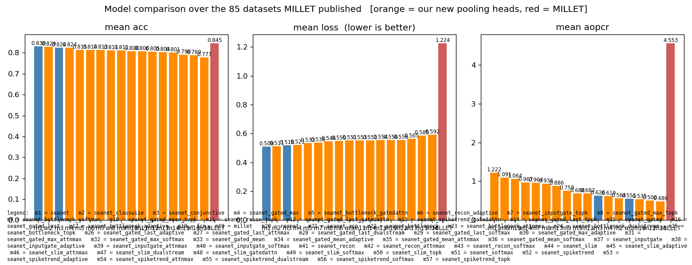
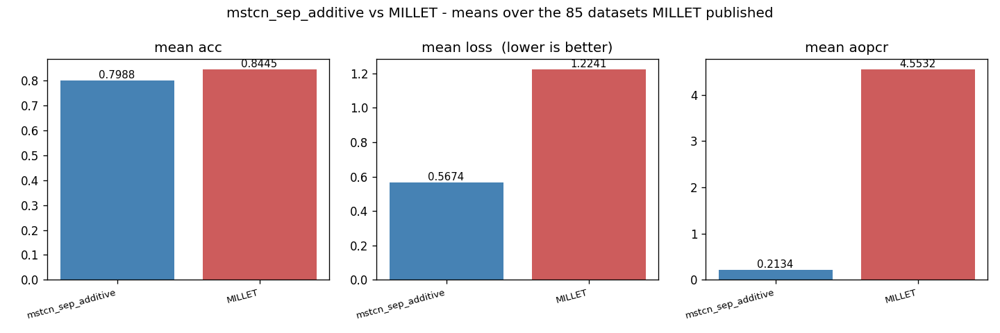
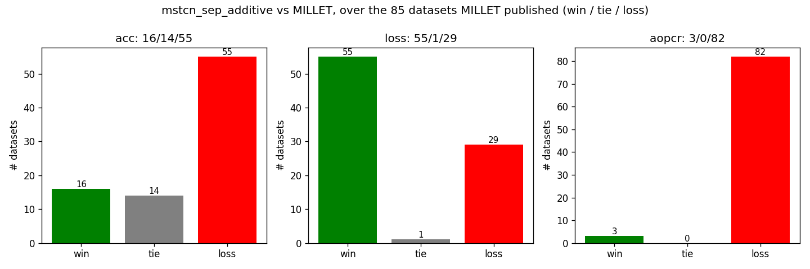
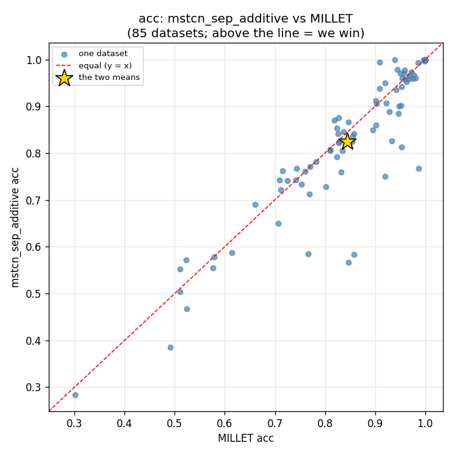
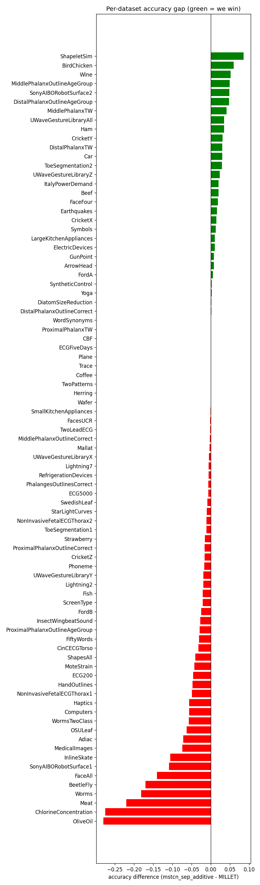
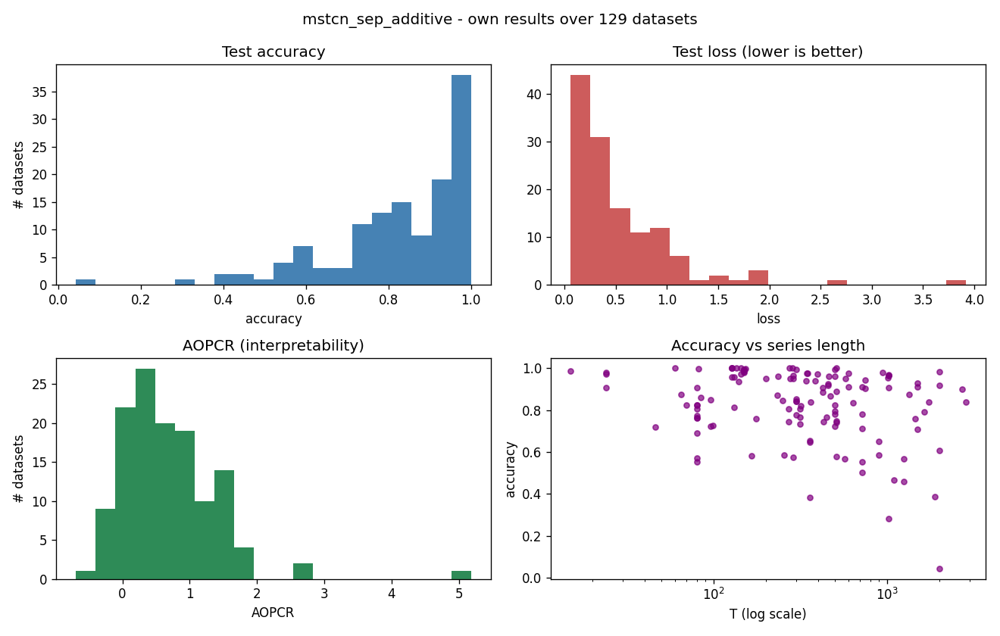

# SEA-Net

An updated, interpretable extension of the MILLET paper:
**"Inherently Interpretable Time Series Classification via Multiple Instance Learning"**
(original code: <https://github.com/JAEarly/MILTimeSeriesClassification>).

The original paper (MILLET) treats each time series as a **bag** of timesteps (Multiple Instance
Learning) and builds a model out of an **InceptionTime** feature extractor + a **Conjunctive**
pooling head. It is interpretable because the pooling head gives an importance score to every
timestep, not just a single class prediction.

**SEA-Net keeps the same idea but swaps the feature extractor.** Instead of InceptionTime we use a
small **Multi-Scale Separable** encoder, and we keep MILLET's **Additive** pooling head (reused
unchanged). The goal was a model that is **smaller**, at least **as accurate**, and **as
interpretable** as the MILLET baseline.

We also add **three new pooling heads** of our own (`classwise_conjunctive`, `softmax_conjunctive`,
`adaptive_classwise`), each aiming to beat MILLET's Conjunctive head while staying interpretable.

**Short version of the result:** SEA-Net uses **36 % fewer parameters** than InceptionTime and still
**matches it** in accuracy when both are trained here under identical settings (0.8262 vs 0.8254),
while **winning on WebTraffic** — the one dataset where interpretability can be measured directly.
See [Results](#results) for the full picture, including where we fall short.

---

## One model = one encoder + one pooling head = one folder

A model here is always **encoder → pooling head**, so it is named after exactly that:
`<encoder>_<pooling>`. That name is the folder its results live in, so nothing is shared and any two
models can be compared fairly:

```
results/
  UCR/, WebTraffic/                # MILLET's published numbers (read-only, for comparison)
  SEA_NET/
    data_summary.csv               # shared: facts about the DATA
    model_comparison.csv           # shared: the "which pooling wins?" ranking
    figures/                       # shared: data_summary.png + model_comparison.png

    mstcn_sep_additive/            # <- one model (configs/models/seanet.yaml)
      results.csv                  # one row per dataset, updated in place
      done_train_dataset.txt       # the resume list
      comparison_vs_millet.csv     # our numbers next to MILLET's
      summary.csv / summary.md     # the headline means
      logs/  figures/  interpretation/

    mstcn_sep_adaptive_classwise/  # <- another model, same layout
```

`--model` names a **config file** under `configs/models/` (without `.yaml`); the folder comes from
what that file builds:

| `--model` | encoder | pooling | results folder |
|---|---|---|---|
| `seanet` | mstcn_sep | additive | `mstcn_sep_additive` |
| `seanet_conjunctive` | mstcn_sep | conjunctive | `mstcn_sep_conjunctive` |
| `seanet_classwise` | mstcn_sep | classwise_conjunctive | `mstcn_sep_classwise_conjunctive` |
| `seanet_softmax` | mstcn_sep | softmax_conjunctive | `mstcn_sep_softmax_conjunctive` |
| `seanet_acp` | mstcn_sep | adaptive_classwise | `mstcn_sep_adaptive_classwise` |
| `millet` | inceptiontime | conjunctive | `inceptiontime_conjunctive` |
| `resnet` | resnet | conjunctive | `resnet_conjunctive` |
| `fcn` | fcn | conjunctive | `fcn_conjunctive` |
| `transformer` | *(placeholder)* | additive | *(not implemented yet)* |

The last three are **baselines**: they take MILLET's own backbones (InceptionTime, ResNet, FCN) and
train them here with the *same* recipe as SEA-Net. That is what makes the comparison fair — we are
not only comparing against numbers printed in a paper, we are comparing against the same backbones
trained on the same machine, same epochs, same everything, with only the encoder swapped.

**Resuming / retraining.** Each model's `done_train_dataset.txt` lists the datasets it has finished;
`train` skips them, so a sweep is safe to Ctrl+C and restart. Delete the whole file to retrain
everything, or delete one name to retrain just that dataset - the new numbers **replace** that
dataset's old row.

---

## Results

All **8 models** have now been swept over WebTraffic + all 128 UCR datasets (trained on Grid5000
GPUs, Lille and Sophia). The tables below are read straight out of
`results/SEA_NET/model_comparison.csv`.

### The headline numbers

Every model is ranked by mean accuracy over the **85 datasets the MILLET paper published**, so the
head-to-head is fair. `MILLET (paper)` is the published Conjunctive baseline we compare against.

| model | mean acc | mean loss | mean AOPCR | WebTraffic acc | WebTraffic NDCG | params |
|---|---|---|---|---|---|---|
| **`mstcn_sep_classwise_conjunctive`** (ours) | **0.8262** | 0.5170 | 0.5111 | 0.950 | 0.7066 | **269 k** |
| `inceptiontime_conjunctive` (baseline, ours) | 0.8254 | 0.5293 | 0.6957 | 0.898 | 0.6910 | 424 k |
| `mstcn_sep_additive` (SEA-Net) | 0.8245 | **0.5141** | 0.5981 | 0.954 | **0.7262** | **269 k** |
| `mstcn_sep_conjunctive` (ours) | 0.8214 | 0.5184 | 0.6129 | **0.958** | 0.6924 | **269 k** |
| `mstcn_sep_adaptive_classwise` (ours) | 0.8199 | 0.5350 | 0.7141 | 0.944 | 0.5813 | **269 k** |
| `mstcn_sep_softmax_conjunctive` (ours) | 0.8172 | 0.5385 | 0.5150 | 0.896 | 0.6262 | **269 k** |
| `resnet_conjunctive` (baseline, ours) | 0.8139 | 0.5638 | 1.1912 | 0.778 | 0.5318 | 506 k |
| `fcn_conjunctive` (baseline, ours) | 0.8092 | 0.5789 | 1.3604 | 0.732 | 0.5345 | 267 k |
| *MILLET (paper, 5 reps)* | *0.8445* | *1.2241* | *4.5532* | — | — | *424 k* |



### What we actually achieved

**1. Smaller — yes, clearly.** SEA-Net uses **269 k parameters vs InceptionTime's 424 k**: about
**36 % fewer weights** (3.54 MB vs 4.11 MB on disk). ResNet is even bigger at 506 k. This was the
main goal and it worked.

**2. As accurate — yes, when the comparison is fair.** Our best SEA-Net variant reaches **0.8262**
and our own InceptionTime baseline reaches **0.8254** — a gap of **0.0008**, which is nothing. So
under identical training, the small separable encoder matches the much bigger InceptionTime encoder.

Both of them sit **below the paper's published 0.8445**. That gap is *not* caused by the encoder —
if it were, our InceptionTime would have matched the paper. It is caused by the **training budget**:
MILLET averages **5 repeats** per dataset, while we train **one** run per dataset. One run gets
unlucky sometimes; averaging 5 smooths that out. This is the honest reading of the result.

**3. Better confidence.** Mean test loss is **0.51–0.54 for our models vs 1.2241 for the paper**,
and we win the loss head-to-head **60/1/24**. Lower loss with similar accuracy means our models are
**better calibrated** — when they are wrong, they are wrong less confidently.

**4. Best on WebTraffic.** WebTraffic is the only dataset with per-timestep ground truth, so it is
the one place where interpretability can be *measured directly* rather than estimated. SEA-Net wins
it: **0.958 accuracy** (conjunctive head) and **0.7262 NDCG@n** (additive head), against **0.898 /
0.6910** for our InceptionTime baseline. On the dataset where we can actually check the explanations,
the small model is the better one.

**5. AOPCR is much lower — and this needs care.** Our AOPCR is ~0.5–0.7 against the paper's 4.55,
and we lose that head-to-head 3/0/82. But our **InceptionTime baseline also scores only 0.6957** on
the exact same metric. The same encoder that produced 4.5579 in the paper produces 0.6957 here, so
the difference comes from **our evaluation setup, not from SEA-Net**. AOPCR is not normalised, so
its scale moves with the loss scale — and our losses are ~2.4× smaller. Read AOPCR **only across our
own models** (where `classwise_conjunctive` at 0.5111 and `softmax_conjunctive` at 0.5150 are the
tightest); do **not** read it against the paper's column.

**6. Which pooling head won.** `classwise_conjunctive` (one attention gate per class) gave the best
accuracy, and plain `additive` gave the best loss and the best NDCG. Our fancier `adaptive_classwise`
and `softmax_conjunctive` heads did **not** beat the simple ones — a useful negative result.

### The figures

Each model folder has its own `figures/`. These are from `mstcn_sep_additive` (SEA-Net proper);
every other model has the same six plots.

**Means vs MILLET** — the three metrics side by side, ours next to theirs:



**Win / tie / loss** — how many of the 85 datasets we win, tie and lose on each metric:



**Accuracy scatter** — one dot per dataset, ours vs MILLET's. Dots on the diagonal are ties; above
the line we win. Most dots sit close to the line, which is the "we match them" story in one picture:



**Accuracy difference per dataset** — the same thing as bars, so you can see *which* datasets we
win and lose on rather than just how many:



**Our own spread** — how accuracy, loss and AOPCR are distributed across all 128 datasets, plus
accuracy against series length (it does not fall off for long series, which is what the capped
dilation was for):



**The data itself** — lengths, class counts, train sizes, and which datasets needed the adjusted
folder:


### Reproducing this

```bash
python main.py train --model seanet        # sweep one model over WebTraffic + all 128 UCR
python main.py train --model seanet_acp    # ... and again for another pooling head
python main.py results                     # the comparison vs MILLET + the cross-model ranking
python main.py report                      # every figure + summary table
```

> **Note on the InceptionTime baseline.** Its row covers **84** of the 85 published datasets and
> **124** of 128 UCR — a few runs did not finish in the job's time limit. All seven other models
> cover the full 85 / 128. So treat its mean as very slightly noisier than the rest.

Each model has its own `results/SEA_NET/<encoder>_<pooling>/summary.csv` with:

* **the fair head-to-head** - mean accuracy / loss / AOPCR over the **85 datasets MILLET published**,
  ours next to theirs, plus the win/tie/loss record;
* **the overall mean** over every UCR dataset we trained (MILLET never reported these, so there is
  nothing to compare them to);
* **WebTraffic** accuracy + NDCG@n (the only dataset with per-timestep ground truth).

`results/SEA_NET/model_comparison.csv` ranks every model that has been swept, and
`results/SEA_NET/figures/model_comparison.png` shows each one's means next to MILLET's.

---

## Architecture

SEA-Net is just **`input → encoder → pooling head`**. The encoder (`MSTCNSepEncoder`) is the new
part; the pooling head (`MILAdditivePooling`) is reused from MILLET unchanged. The three views below
go from the whole network down to a single block. Throughout, **`B`** = batch, **`T`** = series
length (never changes), **`C`** = number of classes.

### Level 1 — the whole network (tensor shapes)


The input series `(B, 1, T)` goes through the encoder to per-timestep features `(B, 128, T)`, then
the Additive pooling head produces three outputs: `bag_logits (B, C)` (the class scores),
`interpretation (B, C, T)` (importance of each timestep, used by AOPCR / NDCG), and `attn (B, T, 1)`
(the attention gate, used by the training focus penalty).

### Level 2 — inside the encoder (`MSTCNSepEncoder`)


A stem `Conv1d(1 → 128, k=7)` lifts the single channel to 128 channels, then **6 residual blocks**
run with dilations **1, 2, 4, 8, 16, 16** (capped at 16 to keep each timestep's view local). Zero
"same" padding keeps the length `T` the same all the way through — so deleting a timestep (which AOPCR
does) never changes the shape.

### Level 3 — inside one block (`MultiScaleSepBlock`)


Each block runs a "unit" **twice** and then adds the input back (residual). A unit runs three
depthwise convolutions (kernels **5 / 11 / 23**) in parallel and **sums** them (multi-scale), then a
`1×1` pointwise conv mixes the channels, followed by BatchNorm → ReLU → Dropout. Depthwise-separable
convs use very few weights (this is what makes SEA-Net small); the shape stays `(B, d, T)` in and out.

---

## What we reuse and what we change

The pipeline has four stages: **data → model → train → results**. Below is exactly what came
straight from MILLET and what is new in SEA-Net.

### 1. Data — `seanet/data.py` (mostly reused)

- **Reused:** MILLET's `UCRDataset`, `WebTrafficDataset`, and the base `MILTSCDataset` (which does
  the z-normalisation). We do not re-implement loading or normalisation.
- **New:** one entry point, `load_dataset(name, split)`, so the whole project loads any dataset
  (WebTraffic or any of the 128 UCR) the same way, by name.
- **Change (routing only, no MILLET edit):** 15 UCR datasets have missing values or variable-length
  series, so their **raw** files contain `NaN`, which would break normalisation. The UCR archive
  ships pre-fixed copies of those 15 in a special folder. `AdjustedUCRDataset` subclasses MILLET's
  `UCRDataset` and reads from that folder for those 15 names only. Everything else is untouched.
  (See `AdjustedUCRDataset` and `ucr_tsv_path` in `seanet/data.py`.)
- **New helper:** `read_our_csv()` reads our own csv files tolerantly, because a tool on the build
  machine keeps padding csv columns with spaces.

### 2. Model — `seanet/model.py` (encoder is new, pooling is reused)

- **New (the "SEA" part):** `MSTCNSepEncoder`, built from `MultiScaleSepBlock`. Each block runs
  three kernel sizes (5 / 11 / 23) in parallel and adds them (multi-scale), uses depthwise-separable
  convolutions (few weights → small model), grows the dilation 1,2,4,8,16 but caps it at 16 (keeps
  each timestep's view local, which keeps the importance scores honest), and zero-pads so the series
  length T never changes.
- **Reused:** MILLET's `MILAdditivePooling` head, used as-is. It turns the encoder's per-timestep
  features into (a) a class prediction, (b) a per-timestep importance vector (the interpretation),
  and (c) an attention gate.
- **Glue:** `EncoderPoolNet` just wires "encoder → pooling head" together. `make_sea_net()` builds
  SEA-Net; `make_baseline()` builds MILLET's InceptionTime + Conjunctive model for comparison.

### 3. Train — `seanet/train.py` (reused loop, one new penalty)

- **Reused:** MILLET's `MILLETModel` training/evaluation machinery (loss, dataloaders, the AOPCR /
  NDCG interpretability metrics).
- **New:** `SeaNetModel` subclasses `MILLETModel` and adds a small **attention-entropy penalty**
  (λ = 0.01) to the loss, which nudges the attention gate to focus on fewer timesteps.
- **New robustness:** a validation split for early stopping (stratified 80/20 when there are enough
  training series, otherwise train-loss), label smoothing, and `safe_evaluate()` which falls back
  to `AUROC = NaN` when a test split is missing a class (which would otherwise crash `roc_auc_score`).
- **Windows fix:** `get_device()` replaces MILLET's GPU picker, which raises on Windows.

### 4. Results — `seanet/results.py` (all new bookkeeping)

- Every model writes into its **own folder** `results/SEA_NET/<encoder>_<pooling>/`, so two models
  can never mix their numbers up.
- Each finished dataset gets one row in that model's `results.csv` and its name in
  `done_train_dataset.txt`. `save_result_row()` is an **upsert**: re-running a dataset replaces its
  old row, so the table always holds the newest numbers - one row per dataset, no duplicates.
- **Resumable:** a long sweep can stop and restart; `result_exists()` checks
  `done_train_dataset.txt` and skips anything already done. That file is plain text (the csv-padding
  tool leaves it alone), and `results.csv` is written atomically (temp file, then rename), so a run
  can't corrupt itself mid-write.
- **The order is MILLET's:** `sweep_order()` trains WebTraffic, then the 85 datasets MILLET
  published in the paper's order, then the rest of UCR - so the head-to-head table is ready early.
- `build_comparison()` joins our UCR numbers to the MILLET paper's published numbers
  (`results/UCR/InceptionTime/`, the 5-rep Conjunctive baseline) and labels each dataset
  win / tie / loss on **accuracy, loss and AOPCR** (for loss, lower is the win).
- `summarise_model()` reports two means, kept apart on purpose: the fair head-to-head over the 85
  datasets MILLET published, and our overall mean over everything we trained.
- `compare_models()` ranks every swept model into `model_comparison.csv`.

---

## Getting the data

The datasets are **not** included in this repo (they are large and have their own licenses), so you
download them once and place them under `data/`. The code checks what is on disk and tells you
clearly if anything is missing.

### WebTraffic (synthetic, ~19 MB)

This is MILLET's synthetic dataset. Copy its four files from the original MILLET repo
([`data/WebTraffic/`](https://github.com/JAEarly/MILTimeSeriesClassification/tree/master/data/WebTraffic))
into `data/WebTraffic/` here:

```
data/WebTraffic/
  WebTraffic_TRAIN.csv
  WebTraffic_TEST.csv
  WebTraffic_TRAIN_metadata.json
  WebTraffic_TEST_metadata.json
```

### UCR archive (128 datasets, ~260 MB zipped)

Download `UCRArchive_2018.zip` from the official UCR page and unzip it into `data/UCR/`:

- Archive page: <https://www.cs.ucr.edu/~eamonn/time_series_data_2018/>
- Direct link: <https://www.cs.ucr.edu/~eamonn/time_series_data_2018/UCRArchive_2018.zip>

The zip is **password-protected**; the password is given in the archive's briefing document
([BriefingDocument2018.pdf](https://www.cs.ucr.edu/~eamonn/time_series_data_2018/BriefingDocument2018.pdf))
on that page. After unzipping, `data/UCR/` should contain one folder per dataset, e.g.:

```
data/UCR/
  Coffee/Coffee_TRAIN.tsv, Coffee_TEST.tsv
  ECG200/...
  ...
  Missing_value_and_variable_length_datasets_adjusted/   <- keep this folder; the 15 fixed datasets live here
```

Keep the `Missing_value_and_variable_length_datasets_adjusted/` folder — it holds the cleaned copies
of the 15 problem datasets (see [Adjustments to the MILLET code](#adjustments-to-the-millet-code)).

---

## How to run

Everything runs through `main.py`:

```bash
python main.py summary                       # quick WebTraffic + Coffee data demo
python main.py summary --all                 # summarise WebTraffic + all 128 UCR -> data_summary.csv
python main.py params                        # print SEA-Net vs baseline parameter counts

python main.py train --model seanet          # the full sweep for ONE model (resumable)
python main.py single Coffee --model seanet  # train + evaluate one dataset
python main.py webtraffic --model seanet     # train on WebTraffic + compare to MILLET
python main.py interpret --model seanet      # 3 explanation figures (WebTraffic)
python main.py optuna --model seanet         # hyperparameter search

python main.py results                       # comparison vs MILLET + the cross-model ranking
python main.py results --model seanet        # just one model's comparison
python main.py report                        # every figure + summary table
```

`--model` is a config file under `configs/models/` without the `.yaml`. Add `--smoke` to any
training command for a quick 3-epoch check (smoke runs are never saved).

Every run tees its output to a dated log inside that model's folder
(`results/SEA_NET/<model>/logs/<command>_<date-time>.log`), so nothing is ever overwritten.

`analysis.ipynb` is a read-only notebook that calls `seanet/report.py` and shows the saved figures.

---

## Adjustments to the MILLET code

We kept MILLET's code as-is except for **two tiny fixes** that were needed to make the
interpretability evaluation and the imports run on this setup:

1. `millet/model/millet_model.py` — the interpretability evaluation crashed on every UCR dataset
   because it checked `if "instance_targets" in batch` (a key that is always present but set to
   `None`). Changed to `if batch.get("instance_targets") is not None:`.
2. `millet/data/web_traffic_dataset.py` — removed a cosmetic `@override` decorator and its
   `from overrides import override` import (the `overrides` package is not installed and the
   decorator does nothing at runtime). Also dropped `overrides` from `requirements.txt`.

The NaN / variable-length handling for the 15 problem datasets is **not** a MILLET edit — it is done
by subclassing in `seanet/data.py` and reading the UCR archive's own pre-fixed copies.
