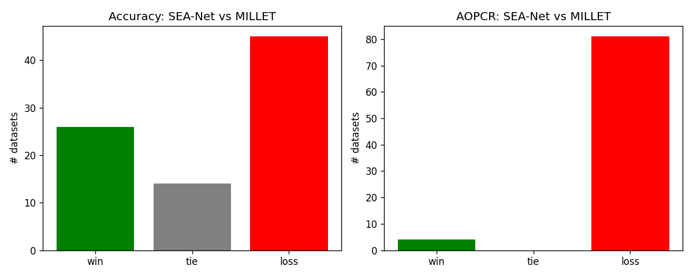
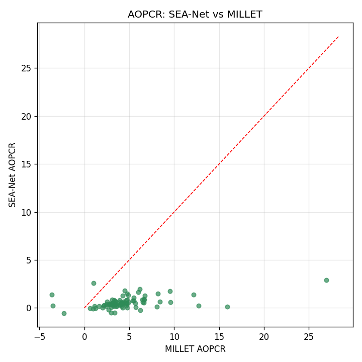
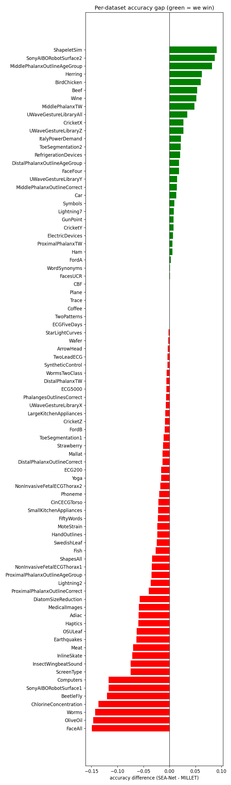
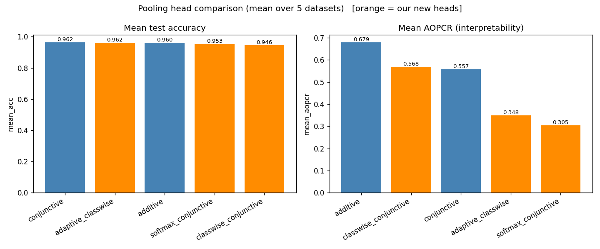
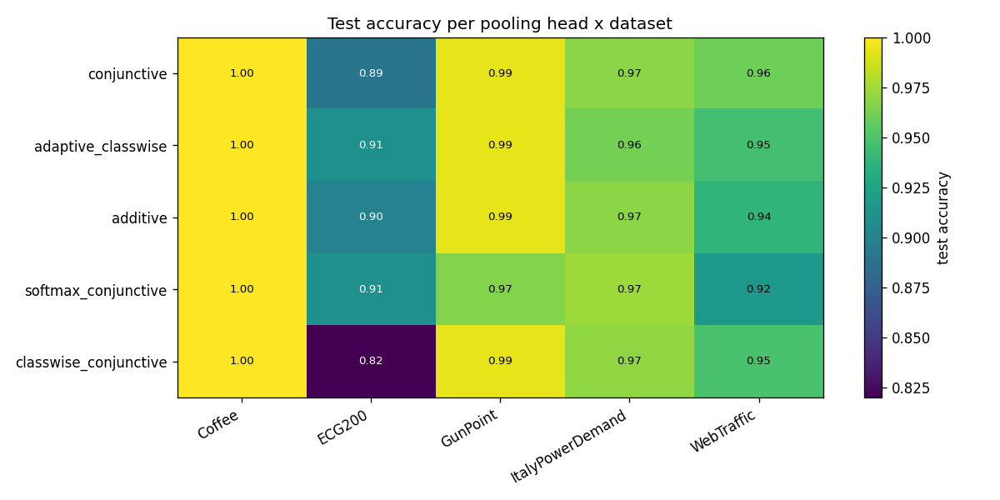
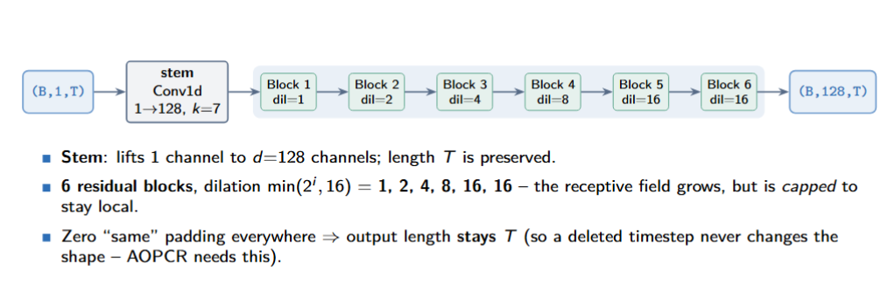
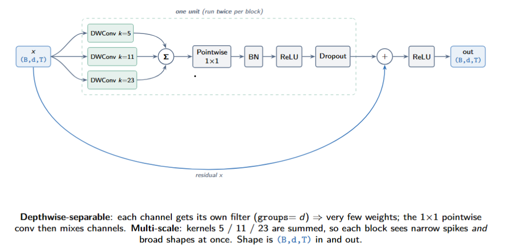

# SEA-Net

An updated, interpretable extension of the MILLET paper:
**"Inherently Interpretable Time Series Classification via Multiple Instance Learning"**
(original code: <https://github.com/JAEarly/MILTimeSeriesClassification>).

The original paper (MILLET) treats each time series as a **bag** of timesteps (Multiple Instance
Learning) and builds a model out of an **InceptionTime** feature extractor + a **Conjunctive**
pooling head. It is interpretable because the pooling head gives an importance score to every
timestep, not just a single class prediction.

**SEA-Net keeps the same idea but swaps the feature extractor.** Instead of InceptionTime we use a
small **Multi-Scale Separable** encoder, and we keep MILLET's **Additive** pooling head (reused
unchanged). The goal was a model that is **smaller**, at least **as accurate**, and **as
interpretable** as the MILLET baseline.

---

<!-- BEGIN AUTO-RESULTS (generated by `python main.py report`) -->
## Results

_Generated by `python main.py report` on 2026-07-15 14:45 from `results/SEA_NET/results.csv`._
_Do not edit this section by hand - it is rewritten on every report._

### Headline (best model per dataset)

| metric | value |
|---|---|
| datasets_with_results | 129 |
| mean_test_accuracy | 0.8296 |
| mean_aopcr | 0.6585 |
| webtraffic_ndcg | 0.7133 |
| params | 269083 |
| model_size_mb | 3.539 |
| millet_overlap_datasets | 85 |
| acc_win_tie_loss | 26/14/45 |
| aopcr_win_tie_loss | 4/0/81 |
| acc_mean_ours_vs_millet | 0.8294 / 0.8445 |
| aopcr_mean_ours_vs_millet | 0.572 / 4.553 |

### Every model we have run

One row per model + settings fingerprint. Change a hyperparameter and the fingerprint changes, so a retrained recipe appears as its own row rather than overwriting the old one.

| model | settings | datasets | mean acc | mean AOPCR | params | last run |
|---|---|---|---|---|---|---|
| SEA-Net | `legacy` | 129 | 0.8296 | 0.6585 | 268,309 | 2026-07-10 14:28 |

### Figures

**data summary**


**results**


**acc scatter**


**win tie loss**



**aopcr scatter**



**acc diff**



**pooling benchmark**



**pooling benchmark by dataset**


<!-- END AUTO-RESULTS -->

---

## Architecture

SEA-Net is just **`input → encoder → pooling head`**. The encoder (`MSTCNSepEncoder`) is the new
part; the pooling head (`MILAdditivePooling`) is reused from MILLET unchanged. The three views below
go from the whole network down to a single block. Throughout, **`B`** = batch, **`T`** = series
length (never changes), **`C`** = number of classes.

### Level 1 — the whole network (tensor shapes)


The input series `(B, 1, T)` goes through the encoder to per-timestep features `(B, 128, T)`, then
the Additive pooling head produces three outputs: `bag_logits (B, C)` (the class scores),
`interpretation (B, C, T)` (importance of each timestep, used by AOPCR / NDCG), and `attn (B, T, 1)`
(the attention gate, used by the training focus penalty).

### Level 2 — inside the encoder (`MSTCNSepEncoder`)



A stem `Conv1d(1 → 128, k=7)` lifts the single channel to 128 channels, then **6 residual blocks**
run with dilations **1, 2, 4, 8, 16, 16** (capped at 16 to keep each timestep's view local). Zero
"same" padding keeps the length `T` the same all the way through — so deleting a timestep (which AOPCR
does) never changes the shape.

### Level 3 — inside one block (`MultiScaleSepBlock`)



Each block runs a "unit" **twice** and then adds the input back (residual). A unit runs three
depthwise convolutions (kernels **5 / 11 / 23**) in parallel and **sums** them (multi-scale), then a
`1×1` pointwise conv mixes the channels, followed by BatchNorm → ReLU → Dropout. Depthwise-separable
convs use very few weights (this is what makes SEA-Net small); the shape stays `(B, d, T)` in and out.

---

## What we reuse and what we change

The pipeline has four stages: **data → model → train → results**. Below is exactly what came
straight from MILLET and what is new in SEA-Net.

### 1. Data — `seanet/data.py` (mostly reused)

- **Reused:** MILLET's `UCRDataset`, `WebTrafficDataset`, and the base `MILTSCDataset` (which does
  the z-normalisation). We do not re-implement loading or normalisation.
- **New:** one entry point, `load_dataset(name, split)`, so the whole project loads any dataset
  (WebTraffic or any of the 128 UCR) the same way, by name.
- **Change (routing only, no MILLET edit):** 15 UCR datasets have missing values or variable-length
  series, so their **raw** files contain `NaN`, which would break normalisation. The UCR archive
  ships pre-fixed copies of those 15 in a special folder. `AdjustedUCRDataset` subclasses MILLET's
  `UCRDataset` and reads from that folder for those 15 names only. Everything else is untouched.
  (See `AdjustedUCRDataset` and `ucr_tsv_path` in `seanet/data.py`.)
- **New helper:** `read_our_csv()` reads our own csv files tolerantly, because a tool on the build
  machine keeps padding csv columns with spaces.

### 2. Model — `seanet/model.py` (encoder is new, pooling is reused)

- **New (the "SEA" part):** `MSTCNSepEncoder`, built from `MultiScaleSepBlock`. Each block runs
  three kernel sizes (5 / 11 / 23) in parallel and adds them (multi-scale), uses depthwise-separable
  convolutions (few weights → small model), grows the dilation 1,2,4,8,16 but caps it at 16 (keeps
  each timestep's view local, which keeps the importance scores honest), and zero-pads so the series
  length T never changes.
- **Reused:** MILLET's `MILAdditivePooling` head, used as-is. It turns the encoder's per-timestep
  features into (a) a class prediction, (b) a per-timestep importance vector (the interpretation),
  and (c) an attention gate.
- **Glue:** `EncoderPoolNet` just wires "encoder → pooling head" together. `make_sea_net()` builds
  SEA-Net; `make_baseline()` builds MILLET's InceptionTime + Conjunctive model for comparison.

### 3. Train — `seanet/train.py` (reused loop, one new penalty)

- **Reused:** MILLET's `MILLETModel` training/evaluation machinery (loss, dataloaders, the AOPCR /
  NDCG interpretability metrics).
- **New:** `SeaNetModel` subclasses `MILLETModel` and adds a small **attention-entropy penalty**
  (λ = 0.01) to the loss, which nudges the attention gate to focus on fewer timesteps.
- **New robustness:** a validation split for early stopping (stratified 80/20 when there are enough
  training series, otherwise train-loss), label smoothing, and `safe_evaluate()` which falls back
  to `AUROC = NaN` when a test split is missing a class (which would otherwise crash `roc_auc_score`).
- **Windows fix:** `get_device()` replaces MILLET's GPU picker, which raises on Windows.

### 4. Results — `seanet/results.py` (all new bookkeeping)

- Every finished dataset appends one row to `results.csv` and its name to `done.txt`.
- **Resumable:** a long sweep can stop and restart; `result_exists()` checks `done.txt` and skips
  anything already done. `done.txt` is plain text (the csv-padding tool leaves it alone) and
  `results.csv` is append-only, so a run can't corrupt itself mid-write.
- `build_comparison()` joins our UCR numbers to the MILLET paper's published numbers
  (`results/UCR/InceptionTime/`, the 5-rep Conjunctive baseline) and labels each dataset
  win / tie / loss on accuracy and AOPCR.

---

## Getting the data

The datasets are **not** included in this repo (they are large and have their own licenses), so you
download them once and place them under `data/`. The code checks what is on disk and tells you
clearly if anything is missing.

### WebTraffic (synthetic, ~19 MB)

This is MILLET's synthetic dataset. Copy its four files from the original MILLET repo
([`data/WebTraffic/`](https://github.com/JAEarly/MILTimeSeriesClassification/tree/master/data/WebTraffic))
into `data/WebTraffic/` here:

```
data/WebTraffic/
  WebTraffic_TRAIN.csv
  WebTraffic_TEST.csv
  WebTraffic_TRAIN_metadata.json
  WebTraffic_TEST_metadata.json
```

### UCR archive (128 datasets, ~260 MB zipped)

Download `UCRArchive_2018.zip` from the official UCR page and unzip it into `data/UCR/`:

- Archive page: <https://www.cs.ucr.edu/~eamonn/time_series_data_2018/>
- Direct link: <https://www.cs.ucr.edu/~eamonn/time_series_data_2018/UCRArchive_2018.zip>

The zip is **password-protected**; the password is given in the archive's briefing document
([BriefingDocument2018.pdf](https://www.cs.ucr.edu/~eamonn/time_series_data_2018/BriefingDocument2018.pdf))
on that page. After unzipping, `data/UCR/` should contain one folder per dataset, e.g.:

```
data/UCR/
  Coffee/Coffee_TRAIN.tsv, Coffee_TEST.tsv
  ECG200/...
  ...
  Missing_value_and_variable_length_datasets_adjusted/   <- keep this folder; the 15 fixed datasets live here
```

Keep the `Missing_value_and_variable_length_datasets_adjusted/` folder — it holds the cleaned copies
of the 15 problem datasets (see [Adjustments to the MILLET code](#adjustments-to-the-millet-code)).

---

## How to run

Everything runs through `main.py`:

```bash
python main.py summary            # quick WebTraffic + Coffee data demo
python main.py summary --all      # summarise WebTraffic + all 128 UCR -> data_summary.csv
python main.py params             # print SEA-Net vs baseline parameter counts
python main.py webtraffic         # train on WebTraffic + compare to MILLET
python main.py single Coffee      # train + evaluate one dataset, save its result
python main.py train              # full sweep: WebTraffic + all 128 UCR (resumable)
python main.py results            # build + print the comparison vs MILLET
```

Add `--smoke` to any training command for a quick 3-epoch check.

`analysis.ipynb` is a read-only notebook that turns `data_summary.csv`, `results.csv`, and the
comparison into the figures above.

---

## Adjustments to the MILLET code

We kept MILLET's code as-is except for **two tiny fixes** that were needed to make the
interpretability evaluation and the imports run on this setup:

1. `millet/model/millet_model.py` — the interpretability evaluation crashed on every UCR dataset
   because it checked `if "instance_targets" in batch` (a key that is always present but set to
   `None`). Changed to `if batch.get("instance_targets") is not None:`.
2. `millet/data/web_traffic_dataset.py` — removed a cosmetic `@override` decorator and its
   `from overrides import override` import (the `overrides` package is not installed and the
   decorator does nothing at runtime). Also dropped `overrides` from `requirements.txt`.

The NaN / variable-length handling for the 15 problem datasets is **not** a MILLET edit — it is done
by subclassing in `seanet/data.py` and reading the UCR archive's own pre-fixed copies.
