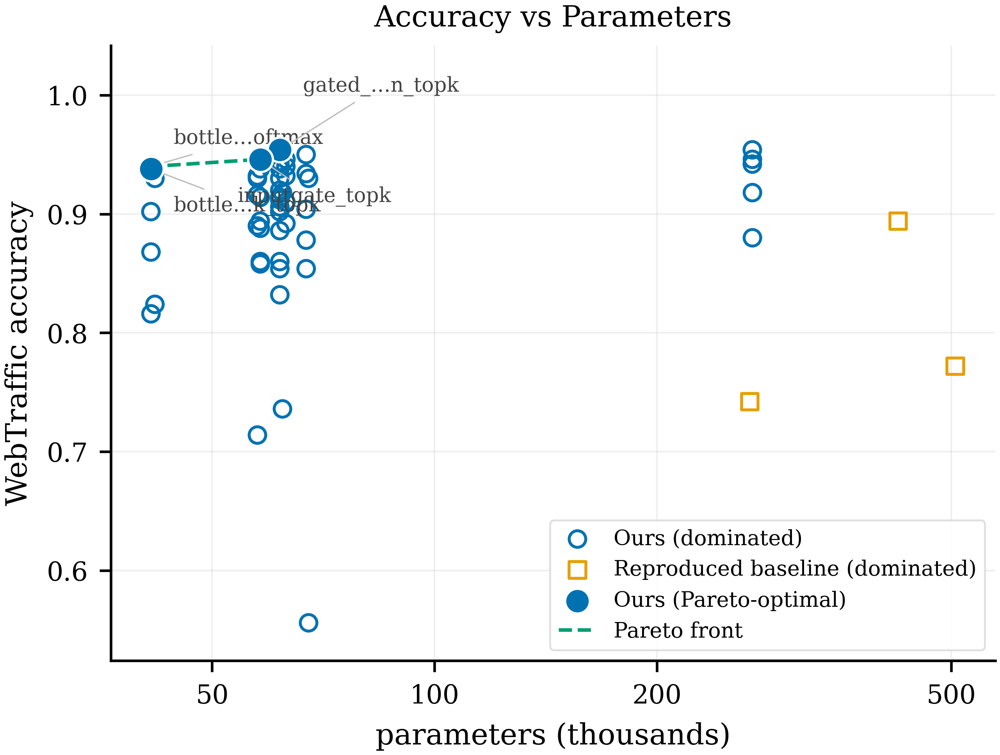
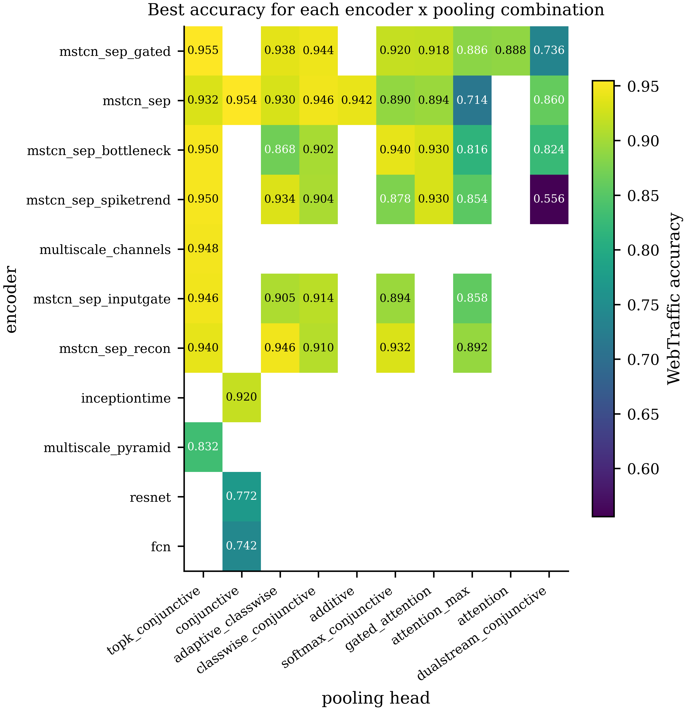
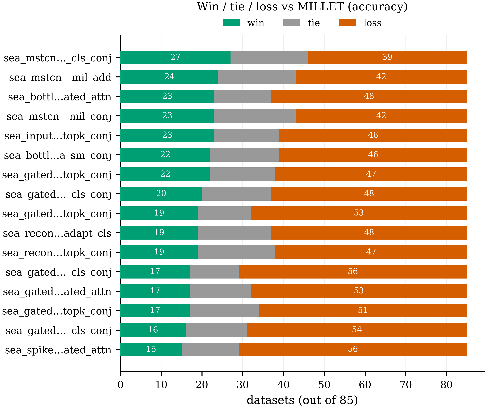
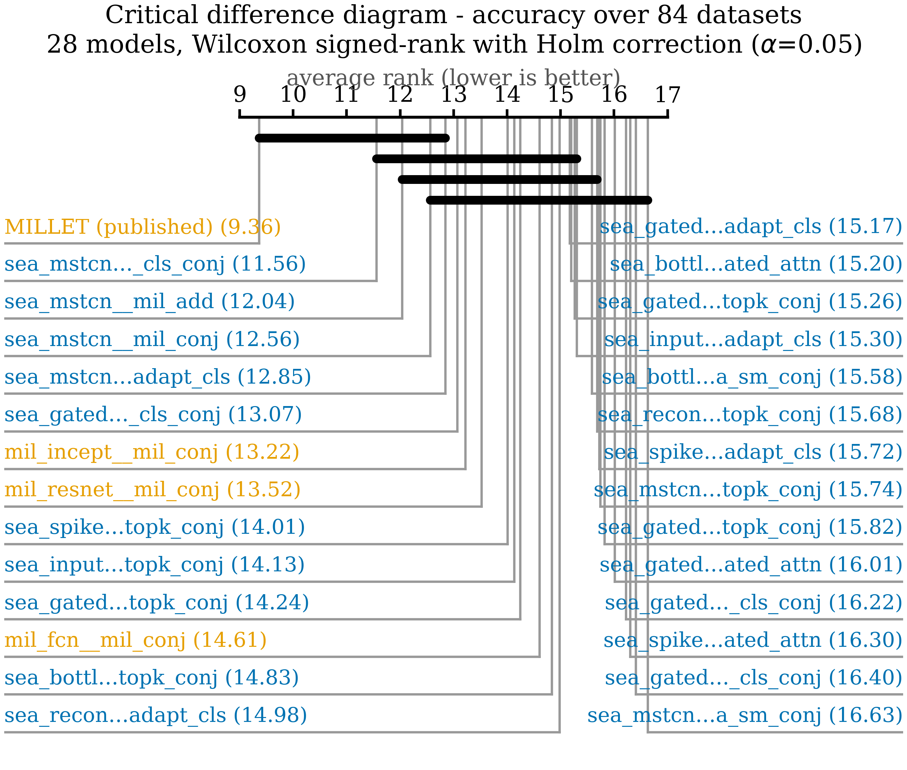
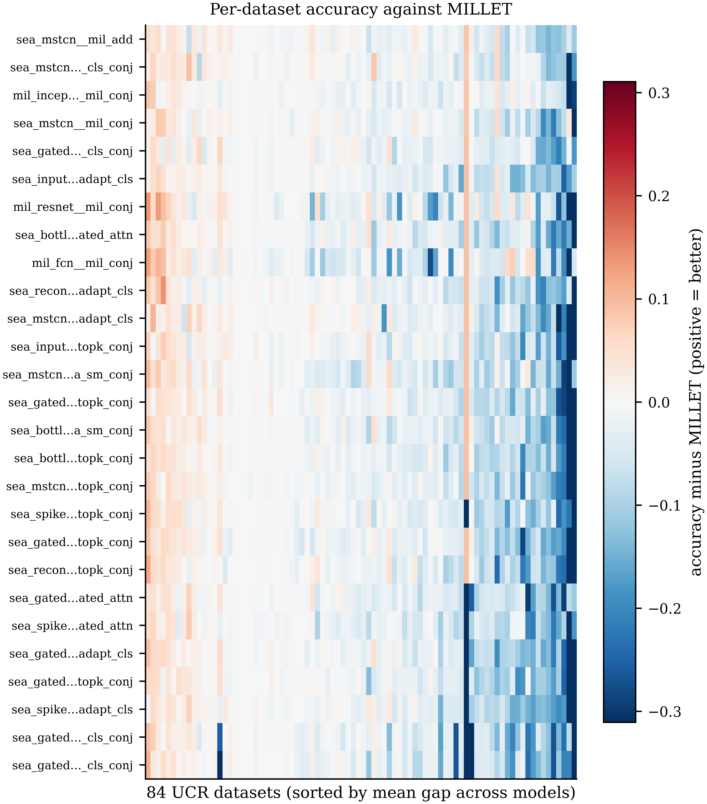
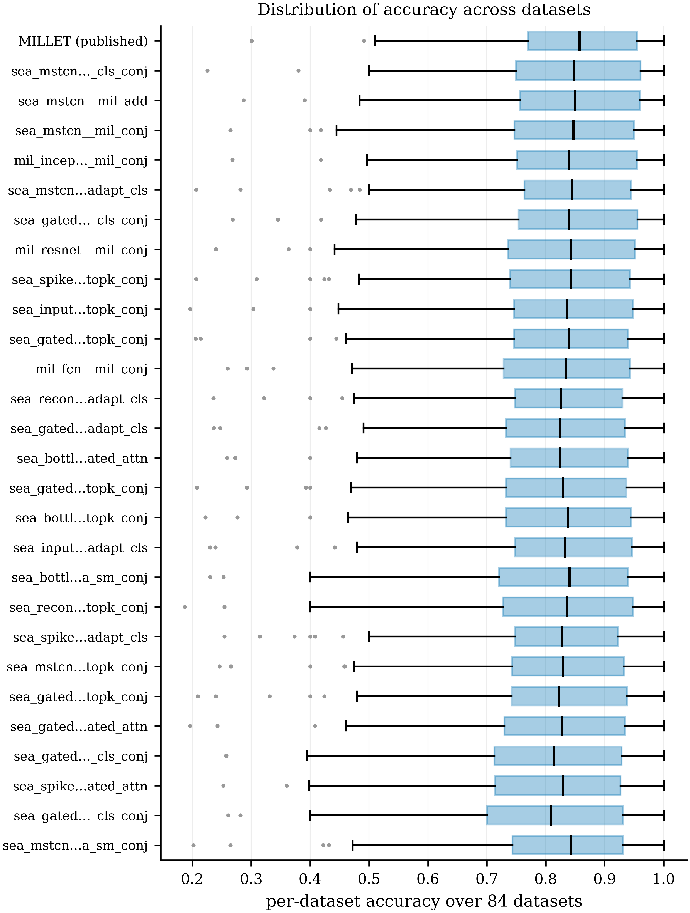
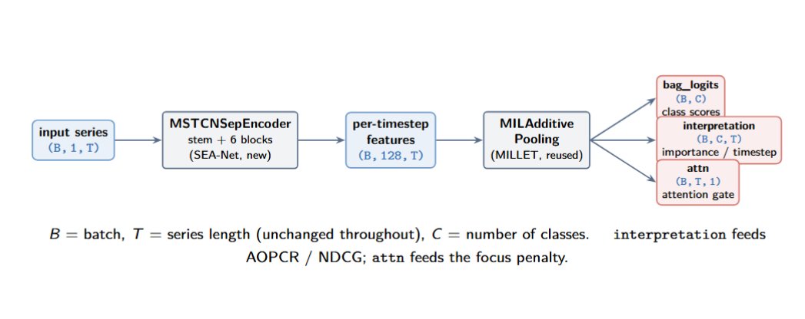

# SEA-Net

An updated, interpretable extension of the MILLET paper:
**"Inherently Interpretable Time Series Classification via Multiple Instance Learning"**
(original code: <https://github.com/JAEarly/MILTimeSeriesClassification>).

The original paper (MILLET) treats each time series as a **bag** of timesteps (Multiple Instance
Learning) and builds a model out of an **InceptionTime** feature extractor + a **Conjunctive**
pooling head. It is interpretable because the pooling head gives an importance score to every
timestep, not just a single class prediction.

**SEA-Net keeps the same idea and replaces both halves.** The encoder is a small **multi-scale
depthwise-separable** TCN (seven variants), and the pooling side adds **seven new MIL pooling
heads** of our own, each one removing a specific limitation of MILLET's Conjunctive head. A model
here is always **encoder + pooling head**, and any pair can be trained from one config file.

**Short version of the result:** on WebTraffic, `seanet_bottleneck_topk` beats the re-trained MILLET
baseline on accuracy (**0.947** vs 0.887), on AOPCR **and** on NDCG@n (**0.773** vs 0.677), with
**90 % fewer parameters** (41 K vs 424 K). `seanet_gated_mean_topk` is the most accurate model of
the 72 we trained (**0.955**). Over the 85 UCR datasets the MILLET baseline is still ahead on
average — we report that plainly. See [Results](#results) below.

---

## 📄 Internship report and its supplement

**The report is in this repo: [`docs/SEA-Net_internship_report.pdf`](docs/SEA-Net_internship_report.pdf)** (29 pages).
Its LaTeX sources are kept private; only the built PDF is published here.

The report is kept under 30 pages, so everything that **supports** the results without being needed
to follow them lives in this README instead of being printed in the PDF:

| Moved out of the report | Where it is now |
|---|---|
| Complete 72-model leaderboard | [Full leaderboard](#full-leaderboard-all-72-models) |
| The four-way comparison against published MILLET | [UCR accuracy](#accuracy-over-the-85-ucr-datasets) (summarised in report Appendix B.4) |
| Encoder × pooling head grid | [Encoder × pooling grid](#encoder--pooling-head-grid) |
| Per-dataset UCR results | [Per-dataset results](#per-dataset-ucr-results) |
| Ensemble voting, Optuna search, the dropped Transformer | [Further experiments](#further-experiments) |
| Win/tie/loss and accuracy-vs-length analyses | [Additional figures](#additional-figures) |
| Pooling-head slot diagrams | [What each pooling head does](#what-each-pooling-head-does) |
| Exact commands and software environment | [Reproducing this](#reproducing-this) and [Environment](#environment) |

---

## What is in this repo

```
main.py                  one entry point for every command (train, results, report, paper, ...)
seanet/                  our code: encoders, pooling heads, training, metrics, figures, tables
millet/                  upstream MILLET, kept unmodified so it stays diffable against theirs
configs/                 one YAML per model, grouped sv1..sv7 (see the table below)
scripts/                 Grid'5000 job submission, profiling, ensemble voting
notebooks/               read-only examples: the MILLET pipeline, a UCR dataset, WebTraffic
results/                 every number and figure in the report, see Results below
model_architecture/      the three architecture diagrams the README embeds
docs/                    the built internship report (PDF)
```

Three things are deliberately **not** here:

| Not in the repo | Why | How to get it |
|---|---|---|
| `data/` | UCR is ~300 MB with its own licence; WebTraffic belongs to MILLET | [Getting the data](#getting-the-data) |
| `model/`, `*.pth` | trained weights, large and regenerated by training | `python main.py train --model <config>` |
| LaTeX sources of the report | kept private | the built PDF is in `docs/` |

Everything else needed to reproduce the numbers is committed: the code, the configs, and the
per-dataset CSVs each figure and table is built from.

---

## One model = one encoder + one pooling head = one folder

A model here is always **encoder → pooling head**, so it is named after exactly that:
`<encoder>_<pooling>`. That name is the folder its results live in, so nothing is shared and any two
models can be compared fairly:

```
results/
  UCR/, WebTraffic/                # MILLET's published numbers (read-only, for comparison)
  SEA_NET/
    data_summary.csv               # shared: facts about the DATA
    model_comparison.csv           # shared: the "which pooling wins?" ranking
    figures/                       # shared: data_summary.png + model_comparison.png

    leaderboard.csv                # shared: all 72 models ranked by WebTraffic accuracy
    profile.csv                    # shared: params / size / FLOPs / latency per model

    seanet_bottleneck_topk/        # <- one model (configs/models/sv4/seanet_bottleneck_topk.yaml)
      results.csv                  # one row per dataset PER SEED, updated in place
      done_train_dataset.txt       # the resume list
      comparison_vs_millet.csv     # our numbers next to MILLET's
      summary.csv / summary.md     # the headline means
      curves/  interpretation/  predictions/

    seanet_gated_mean_topk/        # <- another model, same layout
```

`--model` names a **config file** under `configs/models/` (without `.yaml`); the folder comes from
what that file builds. The configs are grouped by generation:

| group | what is in it | example |
|---|---|---|
| `sv1/` | the **baselines**, MILLET's own backbones re-trained here | `sv1/millet`, `sv1/resnet`, `sv1/fcn`, `sv1/millet_paper` |
| `sv2/` | the wide SEA-Net base encoder (`d = 128`, 6 blocks) | `sv2/seanet` |
| `sv3/` | the wide base encoder × our first pooling heads | `sv3/seanet_classwise`, `sv3/seanet_softmax` |
| `sv4/` | **the main study**: the narrow encoders (`d = 64`, 4 blocks) × every head | `sv4/seanet_bottleneck_topk`, `sv4/seanet_gated_mean_topk` |
| `sv5/` | the dual-stream head | `sv5/seanet_bottleneck_dualstream` |
| `sv6/` | the two wrappers (multi-scale channels, pyramid) | `sv6/seanet_gated_mschan`, `sv6/seanet_bottleneck_pyramid` |
| `sv7/` | the ablations: one line changed from an `sv4` config | `sv7/seanet_topk_k025`, `sv7/seanet_topk_nofocus` |

The **key point** is that `sv1/millet` is not a number copied from the paper: it takes MILLET's own
InceptionTime + Conjunctive model and trains it here with the *same* configuration as SEA-Net, same
machine, same epochs, same everything, with only the encoder and the head swapped. That is what
makes the comparison fair. `sv1/millet_paper` is the same architecture again under **MILLET's own
published recipe**, which is how we proved the remaining gap was the training budget and not our
re-implementation.

`configs/models/transformer.yaml` is a placeholder carrying `implemented: false`; the pipeline
refuses to run it, and it was never trained (see [Further experiments](#further-experiments)).

**Resuming / retraining.** Each model's `done_train_dataset.txt` lists the datasets it has finished;
`train` skips them, so a sweep is safe to Ctrl+C and restart. Delete the whole file to retrain
everything, or delete one name to retrain just that dataset - the new numbers **replace** that
dataset's old row.

---

## Results

**72 encoder × pooling-head combinations** were trained over WebTraffic + the 128 UCR datasets on
Grid'5000 GPU nodes (Lille and Sophia). Every model — ours and the baselines — uses the **same
training configuration**, so any difference comes from the model and not from the recipe. Four
models were re-run with **3 seeds**; the rest are single-seed, and every table says which.

Everything below is read straight out of `results/SEA_NET/leaderboard.csv` and
`results/paper_figures/`, and is regenerated by `python main.py paper`.

### Main comparison on WebTraffic

WebTraffic is the only dataset with per-timestep ground truth, so it is the only place where the
*explanation* can be scored against a known answer (NDCG@n). `*` = mean over 3 seeds.

| # | Model (encoder + pooling head) | config | Accuracy | AOPCR | NDCG@n | Params |
|---|---|---|---|---|---|---|
| 1 | SEA-Net gated (mean) + Top-k `*` | `seanet_gated_mean_topk` | **0.955** | 2.225 | 0.750 | 61,740 |
| 2 | SEA-Net base + conjunctive (MILLET head) | `seanet_conjunctive` | 0.954 | 1.502 | 0.698 | 269,083 |
| 3 | SEA-Net gated (max) + Top-k | `seanet_gated_max_topk` | 0.952 | 2.268 | 0.719 | 61,740 |
| 4 | SEA-Net spike/trend + Top-k | `seanet_spiketrend_topk` | 0.950 | 2.316 | 0.756 | 67,020 |
| 5 | SEA-Net multi-scale channels (input-gated) + Top-k | `seanet_inputgate_mschan` | 0.948 | 2.316 | 0.757 | 69,768 |
| 6 | SEA-Net multi-scale channels (gated) + Top-k | `seanet_gated_mschan` | 0.948 | 2.223 | 0.717 | 67,592 |
| 7 | **SEA-Net bottleneck + Top-k** `*` | `seanet_bottleneck_topk` | 0.947 | 2.621 | **0.773** | **41,324** |
| 8 | SEA-Net reconstruction-residual + adaptive class-wise | `seanet_recon_adaptive` | 0.946 | 2.601 | 0.768 | 62,935 |
| 9 | SEA-Net input-gated + Top-k | `seanet_inputgate_topk` | 0.946 | **2.803** | 0.748 | 58,092 |
| 10 | SEA-Net base + class-wise conjunctive | `seanet_classwise` | 0.946 | 1.722 | 0.686 | 269,164 |
| | SEA-Net input-gated + adaptive class-wise `*` | `seanet_inputgate_adaptive` | 0.905 ± 0.030 | 2.651 ± 0.437 | 0.732 | 58,102 |
| | *MILLET (InceptionTime + conjunctive), re-trained here* `*` | `millet` | *0.887 ± 0.010* | *2.569 ± 0.884* | *0.677* | *423,707* |
| | *ResNet + conjunctive, re-trained here* | `resnet_conjunctive` | *0.772* | *2.952* | *0.554* | *506,331* |
| | *FCN + conjunctive, re-trained here* | `fcn_conjunctive` | *0.742* | *3.826* | *0.533* | *267,035* |

The row that carries the argument is **#7**: the best NDCG@n of the table *and* the smallest
parameter count, so nothing was traded away for the better explanation.




### Accuracy over the 85 UCR datasets

Mean rank is over the 84 datasets shared by the 28 models that finished the whole archive (lower is
better). W/T/L counts each dataset against the **published** MILLET numbers, ties within 0.005.

> The report's main body deliberately shows **only the re-trained rows** of this table, so that
> every comparison in it is between models trained under one identical configuration. The two
> published-MILLET rows and what they mean are kept together in Appendix B.4 of the report, and in
> full below.

| Model | Mean accuracy | Mean rank | W/T/L vs published |
|---|---|---|---|
| `seanet_gated_mean_topk` | 0.8083 | 15.29 | 18 / 13 / 53 |
| `seanet_bottleneck_topk` | 0.8097 | 15.40 | 19 / 15 / 50 |
| `seanet_inputgate_adaptive` | 0.8153 | 15.47 | 19 / 15 / 50 |
| `resnet_conjunctive` | 0.8146 | 13.54 | 25 / 11 / 48 |
| `fcn_conjunctive` | 0.8141 | 14.48 | 20 / 12 / 52 |
| MILLET, our configuration (`millet`) | 0.8274 | 12.60 | 13 / 25 / 46 |
| MILLET, **their** configuration (`millet_paper`) | **0.8434** | **9.41** | **26 / 32 / 26** |
| *MILLET, published* | *0.8445* | — | — |

**Read this honestly:** over the archive the MILLET baseline is ahead of all three of our headline
models. They were chosen because they did well on WebTraffic, and one dataset does not predict 85.

The last two rows are the **same architecture and the same code**, trained twice under two
configurations. Under MILLET's own 1500-epoch recipe our harness reaches **0.8434 against a
published 0.8445** — a reproduction, not an approximation. So the earlier shortfall was the training
budget, never the re-implementation. It also means our models should be compared against the
**0.8274** row, not the published one.

### Model cost

Measured on the real WebTraffic input (length 1008, 10 classes) on one GPU.

| Model | Params | Size (MB) | 1 prediction (ms) | Train (s) |
|---|---|---|---|---|
| `seanet_bottleneck_topk` | **41,324** | **1.43** | 0.131 | 117.3 ± 14.0 |
| `seanet_inputgate_adaptive` | 58,102 | 1.49 | 0.128 | 105.8 ± 37.2 |
| `seanet_gated_mean_topk` | 61,740 | 1.50 | 0.128 | 91.3 ± 25.9 |
| `millet` (re-trained here) | 423,707 | 4.11 | 0.203 | 50.4 ± 9.5 |
| `resnet_conjunctive` | 506,331 | 4.42 | 0.139 | 38.1 |
| `fcn_conjunctive` | 267,035 | 3.47 | **0.068** | 20.8 |

The honest counterweight is the last column: our models take **2–3× longer to train**. That is
wall-clock time until early stopping fires, so it counts epochs needed, not cost per epoch — the
baseline simply stops improving sooner. Per-prediction time is the fair comparison, and there
SEA-Net wins.

### Per-seed spread

| Model | Seed 0 | Seed 1 | Seed 2 | Mean ± std |
|---|---|---|---|---|
| `seanet_gated_mean_topk` | 0.954 | 0.958 | 0.952 | 0.955 ± 0.003 |
| `seanet_bottleneck_topk` | 0.938 | 0.938 | 0.966 | 0.947 ± 0.016 |
| `seanet_inputgate_adaptive` | 0.938 | 0.880 | 0.898 | 0.905 ± 0.030 |
| `millet` (re-trained here) | 0.894 | 0.876 | 0.892 | 0.887 ± 0.010 |

Rule we apply everywhere: **a difference smaller than the seed spread is not a result.**

---

## Full leaderboard (all 72 models)

The complete table, every encoder × pooling head combination ranked by WebTraffic accuracy, is
generated by `python main.py paper` into:

* `results/paper_figures/tables/table_appendix_full_leaderboard.md` — Markdown
* `results/paper_figures/tables/table_appendix_full_leaderboard.csv` — the raw numbers
* `results/SEA_NET/leaderboard.csv` — the source, with every column

Reading it: the `#DS` column says how many UCR datasets each model finished — a dash or a small
number means the model was screened on WebTraffic only. **28** models completed the archive and only
those are ranked above. The `millet_paper` row is MILLET's own long recipe on our harness; its AOPCR
of **13.27** (against 2.57 for the identical architecture under our recipe) is the direct proof that
**AOPCR is unnormalised** and must never be compared across papers.

---

## Ablations

### Encoder × pooling head grid



The most interesting cell is the winner: `seanet_gated_mean_topk` pairs the **gated** encoder (0.902
averaged over its pairings) with **Top-k** pooling (0.904) — both mid-table on their own. Two
ordinary halves make the best whole, which means the encoder and the head **interact** and the
combination has to be searched rather than composed.

### Effect of the pooling head (averaged over encoders)

| Pooling head | Mean accuracy | Mean AOPCR | Mean NDCG@n | n |
|---|---|---|---|---|
| Class-wise conjunctive | 0.921 | 2.322 | 0.692 | 10 |
| Per-class gated attention | 0.918 | 1.869 | 0.733 | 4 |
| Adaptive class-wise | 0.912 | 2.210 | 0.732 | 9 |
| Softmax conjunctive | 0.907 | 1.690 | 0.712 | 9 |
| Top-k conjunctive | 0.904 | 2.267 | 0.712 | 16 |
| Attention-max | 0.838 | 1.758 | 0.645 | 8 |
| Dual-stream conjunctive | 0.744 | 2.007 | 0.636 | 4 |
| *MILLET additive* | *0.942* | *1.579* | *0.729* | *1* |
| *MILLET attention* | *0.888* | *2.403* | *0.710* | *1* |
| *MILLET conjunctive* | *0.839* | *2.712* | *0.616* | *4* |

### Effect of the encoder (averaged over pooling heads)

`†` marks a wrapper (it sits in front of, or around, one of the encoders) rather than an encoder.

| Encoder | Mean accuracy | Mean AOPCR | Mean NDCG@n | n |
|---|---|---|---|---|
| SEA-Net multi-scale channels † | 0.937 | 2.385 | 0.747 | 4 |
| SEA-Net reconstruction-residual | 0.924 | 2.315 | 0.719 | 5 |
| SEA-Net input-gated | 0.904 | 2.345 | 0.718 | 5 |
| SEA-Net gated | 0.902 | 2.056 | 0.710 | 19 |
| SEA-Net base | 0.898 | 1.933 | 0.694 | 12 |
| SEA-Net bottleneck | 0.884 | 2.209 | 0.694 | 8 |
| SEA-Net spike/trend | 0.858 | 1.814 | 0.677 | 7 |
| SEA-Net multi-scale pyramid † | 0.771 | 1.394 | 0.604 | 3 |
| *InceptionTime (MILLET)* | *0.887* | *2.569* | *0.677* | *1* |
| *ResNet* | *0.772* | *2.952* | *0.554* | *1* |
| *FCN* | *0.742* | *3.826* | *0.533* | *1* |

Two cautions: several groups contain very few models, and not every pair was trained — read the grid
cell by cell rather than the means. The bottleneck encoder's 0.884 is dragged down by the weak heads
it was also paired with; with Top-k it reaches 0.947.

### Top-k fraction κ, and the attention entropy term

Both on `seanet_bottleneck_topk`, seed 0, one setting changed at a time.

| κ | Accuracy | Loss | AOPCR | NDCG@n |
|---|---|---|---|---|
| 0.05 | 0.888 | 0.401 | 2.288 | 0.715 |
| **0.10 (default)** | 0.938 | 0.299 | 2.778 | **0.777** |
| 0.25 | **0.940** | **0.277** | 2.648 | 0.733 |
| 0.50 | 0.882 | 0.418 | **3.114** | 0.732 |
| 1.00 (= class-wise) | 0.908 | 0.395 | 2.436 | 0.722 |

| λ_focus | Accuracy | Loss | AOPCR | NDCG@n |
|---|---|---|---|---|
| **0.01 (on, default)** | 0.938 | 0.299 | **2.778** | **0.777** |
| 0.00 (off) | **0.950** | **0.263** | 2.303 | 0.765 |

Both tables say the same thing: **concentrating the evidence improves the explanation and costs
about one accuracy point.** κ = 1.0 *is* class-wise pooling, and it is clearly worse than κ = 0.1,
so the Top-k gain comes from the selection itself. But κ = 0.05 collapses to 0.888 — too aggressive
throws away evidence the classifier needs, so there is a real optimum around 0.1–0.25.

---

## What each pooling head does

Every head shares one template: `z_j → attention branch (slot 1)` and `z_j → per-step classifier`,
their product is the evidence `g_j^k`, and an aggregator over time (**slot 2**) turns the T evidence
values into the bag score. The interpretation is those same `g_j^k` values, never a second branch —
which is why it cannot disagree with the prediction. So a head is fully described by what it puts
in the two slots:

| Head | Slot 1 — attention branch | Slot 2 — how evidence is combined | Reduces to the baseline when |
|---|---|---|---|
| Conjunctive *(MILLET, reused)* | one **shared** gate `σ(wᵀ tanh(W z))` | plain mean over all T | — |
| Class-wise conjunctive | one gate **per class** | plain mean over all T | `a_j^k = a_j` |
| Softmax conjunctive | per-class score → `softmax_j(s/τ)`, sums to 1 | weighted sum; τ learns how peaked | `τ → ∞` |
| Adaptive class-wise | per-class gate | `softmax_j(β_k g_j^k)` weighted sum; β learns mean ↔ max **per class** | `β_k → 0` |
| **Top-k conjunctive** | per-class gate | mean of the `k = ⌈κT⌉` largest; **the rest are dropped outright** | `κ = 1` |
| Attention-max | per-class gate | `(1−λ_k)·mean + λ_k·max`, a hard blend | `λ_k → 0` |
| Per-class gated attention | `tanh(V z) ⊙ σ(U z)`, then per-class score + softmax | weighted sum | **never** — no safety net |
| Dual-stream conjunctive | per-class gate + a query compared with the critical step | blend of the mean stream and the critical-step stream | `λ → 0` |

Only **Top-k** makes the interpretation *exactly zero* where the model used no evidence; every other
head leaves a small weight that never quite reaches zero. That is the mechanism behind its NDCG@n
advantage.

The table above is the whole content of the two slot diagrams that were drawn for the report; they
were dropped from the PDF to save space, and this is the version that replaced them.

---

## Per-dataset UCR results

`seanet_bottleneck_topk` against our own re-trained MILLET baseline, averaged over the seeds each
model has, over the **124** UCR datasets where both have a result. Record: **33 wins, 35 ties,
56 losses** (tie band ±0.005).

| Dataset | SEA-Net | MILLET (re-trained) | Difference |
|---|---|---|---|
| EthanolLevel | 0.754 | 0.272 | **+0.482** |
| SemgHandMovementCh2 | 0.564 | 0.459 | +0.105 |
| DodgerLoopDay | 0.571 | 0.500 | +0.071 |
| OliveOil | 0.400 | 0.556 | −0.156 |
| Mallat | 0.765 | 0.960 | −0.195 |
| PigCVP | 0.585 | 0.798 | −0.213 |

The full 124-row table is `results/paper_figures/tables/table_appendix_per_dataset.{md,csv}`.
Note the biggest win, EthanolLevel at +0.482, is large enough to move a mean on its own — which is
exactly why the UCR table above reports the rank and the win/tie/loss record next to the mean.

---

## Further experiments

### Ensemble voting

Combining our two proposed variants gives a real but small gain, over the 85 UCR datasets:

| Configuration | Mean accuracy |
|---|---|
| `seanet_bottleneck_topk` alone | 0.8237 |
| `seanet_inputgate_adaptive` alone | 0.8253 |
| **Soft vote** | **0.8335** |
| Hard vote | 0.8311 |

About one accuracy point, and soft voting beats hard voting — averaging full probabilities keeps
more information than counting arg-max votes.

**Why these numbers do not match the UCR table above.** A vote needs each model's prediction for
every individual series, and those were only saved from seed 1 onwards. So the ensemble uses seeds 1
and 2 of each model (four voters), and the two "alone" rows average those same two seeds — already a
small self-ensemble. That is the fair internal comparison, but it is why 0.8237 / 0.8253 sit above
the plain per-seed means 0.8097 / 0.8153.

For the on-device goal this is a bad trade: two models roughly double both the parameters and the
inference cost.

```bash
python scripts/ensemble_vote.py \
       --models sv4/seanet_bottleneck_topk sv4/seanet_inputgate_adaptive \
       --baseline sv1/millet
```

### Hyperparameter search (a useful negative result)

A 30-trial Optuna search (TPE sampler) over nine hyperparameters at once — learning rate, weight
decay, label smoothing, the attention entropy weight, the encoder width / depth / dropout / dilation
cap, and the pooling head's attention width — minimising validation loss on WebTraffic.

**It did not beat the hand-set default: 0.906 test accuracy against 0.942.** The default was built
up by hand, one change at a time, while the architecture was being designed, so it was probably
already near a local optimum inside the ranges given to Optuna.

```bash
python main.py optuna --model sv2/seanet
```

### An approach scoped and dropped

A Transformer encoder was planned (`configs/models/transformer.yaml`: 128-d model, 8 heads,
4 layers, reusing MILLET's additive head) but never trained. The config carries an explicit
`implemented: false` flag and the encoder class was never written. It was set aside because the
TCN-family encoders already delivered the parameter saving, and because attention cost grows with
the **square** of the series length — the wrong direction for a microcontroller target.

---

## Additional figures

**Win / tie / loss against the published MILLET results**, per dataset, over the 84 datasets both
report. Rank prefixes use competition ranking, so models with an equal number of wins share a rank
and are marked `=`:



Wins and losses are spread across the whole archive rather than concentrated in a few datasets, so
the near-balanced aggregate record is real and not an artefact of how ties are counted.

**Critical difference diagram** — which models are statistically indistinguishable (Wilcoxon
signed-rank with Holm correction):



**Dataset × model heatmap** — columns are datasets, rows are models. Most of the structure is
*vertical*, which says the dataset matters more than the model on this archive:



**Accuracy against series length.** Checked on `seanet_bottleneck_topk` over all 128 UCR datasets,
averaged over its 3 seeds: the correlation between accuracy and series length is **−0.34**.
Splitting the archive at the median length (344 steps), the shorter half averages **0.857** and the
longer half **0.755** — a gap of about 10 points, far larger than any seed-to-seed spread we
measured.

This is a real limitation of the design and it matches the mechanism: `max_dilation` is 16 in every
SEA-Net config, so the receptive field stops growing after a fixed reach and later blocks work from
an increasingly incomplete view on long series. **Making the dilation cap depend on the series
length is the obvious next experiment.**



---

## Reproducing this

Everything below runs from the project root against a config file under `configs/models/`. No step
needs a hand edit to any code file.

```bash
# train one model over WebTraffic + the UCR archive (resumable)
python main.py train --model sv4/seanet_bottleneck_topk

# add a repeat with a different seed (results are stored per seed)
python main.py train --model sv4/seanet_bottleneck_topk --seed 1

# WebTraffic only, for a screening run or an ablation
python main.py webtraffic --model sv7/seanet_topk_k025

# cost numbers at the real WebTraffic shape
python scripts/profile_models.py --length 1008 --classes 10 --batch 32

# per-sample explanation figures, and the report's page-1 teaser
python main.py interpret --model sv4/seanet_bottleneck_topk
python main.py teaser --models sv1/millet,sv4/seanet_bottleneck_topk

# rebuild every derived file, IN THIS ORDER
python main.py leaderboard   # leaderboard.csv from every model's results.csv
python main.py results       # comparison vs MILLET
python main.py report        # per-model figures + summary tables
python main.py paper         # every report figure AND every LaTeX/Markdown table
```

The order of the last four matters: `paper` reads the leaderboard, and the leaderboard reads every
model's `results.csv`. Every figure and table in the report comes out of `python main.py paper`
directly from those CSVs, so **no number in the report was typed in by hand.**

Each model has its own `results/SEA_NET/<model>/summary.csv` with the fair head-to-head over the 85
published datasets, the overall mean over every UCR dataset trained, and the WebTraffic
accuracy + NDCG@n.

### Environment

Only the Grid'5000 column produced the numbers in the report; the local machine was used for writing
code and small smoke tests.

| | Local (development) | Grid'5000 (training) |
|---|---|---|
| OS | Windows 11 | Linux |
| Python | 3.10.20 | 3.10.20 |
| Conda env | `seanet` | `seanet` (same on both sites) |
| PyTorch | 2.0.1 | 2.0.1 |
| CUDA | cu118 / 11.8 | cu118 / 11.8 |
| GPU | 1× RTX, 6 GB, smoke tests only | depends on the reserved node |
| Sites / clusters | — | Lille (`chuc`, `chifflot`); Sophia (`esterel22`, `esterel40`, `esterel43`) |
| Job scheduler | — | OAR |

Training was launched with `oarsub` on both sites and tracked with MLflow; `scripts/` holds the
job-submission and launcher scripts used to do it.

---

## Architecture

SEA-Net is just **`input → encoder → pooling head`**, and **both halves are ours**: the encoder
(`MSTCNSepEncoder` and its six variants) and the pooling head (seven of our own, see
[What each pooling head does](#what-each-pooling-head-does)). MILLET's heads are still available and
are used for the baselines, so any pair can be compared. The three views below go from the whole
network down to a single block. Throughout, **`B`** = batch, **`T`** = series length (never
changes), **`C`** = number of classes.

> The diagrams below show the **wide** base encoder (`d = 128`, 6 blocks) from `sv2/seanet.yaml`.
> Every model in the report uses the **narrow** setting (`d = 64`, 4 blocks), which is the same
> structure with fewer channels and fewer blocks.

### Level 1 — the whole network (tensor shapes)



The input series `(B, 1, T)` goes through the encoder to per-timestep features `(B, 128, T)`, then
the Additive pooling head produces three outputs: `bag_logits (B, C)` (the class scores),
`interpretation (B, C, T)` (importance of each timestep, used by AOPCR / NDCG), and `attn (B, T, 1)`
(the attention gate, used by the training focus penalty).

### Level 2 — inside the encoder (`MSTCNSepEncoder`)


A stem `Conv1d(1 → 128, k=7)` lifts the single channel to 128 channels, then **6 residual blocks**
run with dilations **1, 2, 4, 8, 16, 16** (capped at 16 to keep each timestep's view local). Zero
"same" padding keeps the length `T` the same all the way through — so deleting a timestep (which AOPCR
does) never changes the shape.

### Level 3 — inside one block (`MultiScaleSepBlock`)


Each block runs a "unit" **twice** and then adds the input back (residual). A unit runs three
depthwise convolutions (kernels **5 / 11 / 23**) in parallel and **sums** them (multi-scale), then a
`1×1` pointwise conv mixes the channels, followed by BatchNorm → ReLU → Dropout. Depthwise-separable
convs use very few weights (this is what makes SEA-Net small); the shape stays `(B, d, T)` in and out.

---

## What we reuse and what we change

The pipeline has four stages: **data → model → train → results**. Below is exactly what came
straight from MILLET and what is new in SEA-Net.

### 1. Data — `seanet/data.py` (mostly reused)

- **Reused:** MILLET's `UCRDataset`, `WebTrafficDataset`, and the base `MILTSCDataset` (which does
  the z-normalisation). We do not re-implement loading or normalisation.
- **New:** one entry point, `load_dataset(name, split)`, so the whole project loads any dataset
  (WebTraffic or any of the 128 UCR) the same way, by name.
- **Change (routing only, no MILLET edit):** 15 UCR datasets have missing values or variable-length
  series, so their **raw** files contain `NaN`, which would break normalisation. The UCR archive
  ships pre-fixed copies of those 15 in a special folder. `AdjustedUCRDataset` subclasses MILLET's
  `UCRDataset` and reads from that folder for those 15 names only. Everything else is untouched.
  (See `AdjustedUCRDataset` and `ucr_tsv_path` in `seanet/data.py`.)
- **New helper:** `read_our_csv()` reads our own csv files tolerantly, because a tool on the build
  machine keeps padding csv columns with spaces.

### 2. Model — `seanet/model.py` (encoder is new, pooling is reused)

- **New (the "SEA" part):** `MSTCNSepEncoder`, built from `MultiScaleSepBlock`. Each block runs
  three kernel sizes (5 / 11 / 23) in parallel and adds them (multi-scale), uses depthwise-separable
  convolutions (few weights → small model), grows the dilation 1,2,4,8,16 but caps it at 16 (keeps
  each timestep's view local, which keeps the importance scores honest), and zero-pads so the series
  length T never changes.
- **Reused:** MILLET's `MILAdditivePooling` head, used as-is. It turns the encoder's per-timestep
  features into (a) a class prediction, (b) a per-timestep importance vector (the interpretation),
  and (c) an attention gate.
- **Glue:** `EncoderPoolNet` just wires "encoder → pooling head" together. `make_sea_net()` builds
  SEA-Net; `make_baseline()` builds MILLET's InceptionTime + Conjunctive model for comparison.

### 3. Train — `seanet/train.py` (reused loop, one new penalty)

- **Reused:** MILLET's `MILLETModel` training/evaluation machinery (loss, dataloaders, the AOPCR /
  NDCG interpretability metrics).
- **New:** `SeaNetModel` subclasses `MILLETModel` and adds a small **attention-entropy penalty**
  (λ = 0.01) to the loss, which nudges the attention gate to focus on fewer timesteps.
- **New robustness:** a validation split for early stopping (stratified 80/20 when there are enough
  training series, otherwise train-loss), label smoothing, and `safe_evaluate()` which falls back
  to `AUROC = NaN` when a test split is missing a class (which would otherwise crash `roc_auc_score`).
- **Windows fix:** `get_device()` replaces MILLET's GPU picker, which raises on Windows.

### 4. Results — `seanet/results.py` (all new bookkeeping)

- Every model writes into its **own folder** `results/SEA_NET/<encoder>_<pooling>/`, so two models
  can never mix their numbers up.
- Each finished dataset gets one row in that model's `results.csv` and its name in
  `done_train_dataset.txt`. `save_result_row()` is an **upsert**: re-running a dataset replaces its
  old row, so the table always holds the newest numbers - one row per dataset, no duplicates.
- **Resumable:** a long sweep can stop and restart; `result_exists()` checks
  `done_train_dataset.txt` and skips anything already done. That file is plain text (the csv-padding
  tool leaves it alone), and `results.csv` is written atomically (temp file, then rename), so a run
  can't corrupt itself mid-write.
- **The order is MILLET's:** `sweep_order()` trains WebTraffic, then the 85 datasets MILLET
  published in the paper's order, then the rest of UCR - so the head-to-head table is ready early.
- `build_comparison()` joins our UCR numbers to the MILLET paper's published numbers
  (`results/UCR/InceptionTime/`, the 5-rep Conjunctive baseline) and labels each dataset
  win / tie / loss on **accuracy, loss and AOPCR** (for loss, lower is the win).
- `summarise_model()` reports two means, kept apart on purpose: the fair head-to-head over the 85
  datasets MILLET published, and our overall mean over everything we trained.
- `compare_models()` ranks every swept model into `model_comparison.csv`.

---

## Getting the data

The datasets are **not** included in this repo (they are large and have their own licenses), so you
download them once and place them under `data/`. The code checks what is on disk and tells you
clearly if anything is missing.

### WebTraffic (synthetic, ~19 MB)

This is MILLET's synthetic dataset. Copy its four files from the original MILLET repo
([`data/WebTraffic/`](https://github.com/JAEarly/MILTimeSeriesClassification/tree/master/data/WebTraffic))
into `data/WebTraffic/` here:

```
data/WebTraffic/
  WebTraffic_TRAIN.csv
  WebTraffic_TEST.csv
  WebTraffic_TRAIN_metadata.json
  WebTraffic_TEST_metadata.json
```

### UCR archive (128 datasets, ~260 MB zipped)

Download `UCRArchive_2018.zip` from the official UCR page and unzip it into `data/UCR/`:

- Archive page: <https://www.cs.ucr.edu/~eamonn/time_series_data_2018/>
- Direct link: <https://www.cs.ucr.edu/~eamonn/time_series_data_2018/UCRArchive_2018.zip>

The zip is **password-protected**; the password is given in the archive's briefing document
([BriefingDocument2018.pdf](https://www.cs.ucr.edu/~eamonn/time_series_data_2018/BriefingDocument2018.pdf))
on that page. After unzipping, `data/UCR/` should contain one folder per dataset, e.g.:

```
data/UCR/
  Coffee/Coffee_TRAIN.tsv, Coffee_TEST.tsv
  ECG200/...
  ...
  Missing_value_and_variable_length_datasets_adjusted/   <- keep this folder; the 15 fixed datasets live here
```

Keep the `Missing_value_and_variable_length_datasets_adjusted/` folder — it holds the cleaned copies
of the 15 problem datasets (see [Adjustments to the MILLET code](#adjustments-to-the-millet-code)).

---

## How to run

Everything runs through `main.py`:

`--model` is the config file's path under `configs/models/`, **without** the `.yaml`, so it always
carries its group: `sv4/seanet_bottleneck_topk`, not `seanet_bottleneck_topk`.

```bash
python main.py summary                                      # quick WebTraffic + Coffee data demo
python main.py summary --all                                # all 128 UCR -> data_summary.csv
python main.py params                                       # SEA-Net vs baseline parameter counts

python main.py train --model sv4/seanet_bottleneck_topk     # full run for ONE model (resumable)
python main.py single Coffee --model sv4/seanet_bottleneck_topk   # one dataset only
python main.py webtraffic --model sv4/seanet_bottleneck_topk      # WebTraffic + compare to MILLET
python main.py interpret --model sv4/seanet_bottleneck_topk       # explanation figures
python main.py optuna --model sv2/seanet                    # hyperparameter search

python main.py results                                      # comparison vs MILLET + ranking
python main.py report                                       # every figure + summary table
python main.py paper                                        # every report figure AND table
```

`--model` is a config file under `configs/models/` without the `.yaml`. Add `--smoke` to any
training command for a quick 3-epoch check (smoke runs are never saved).

Every run tees its output to a dated log inside that model's folder
(`results/SEA_NET/<model>/logs/<command>_<date-time>.log`), so nothing is ever overwritten.

`analysis.ipynb` is a read-only notebook that calls `seanet/report.py` and shows the saved figures.

---

## Adjustments to the MILLET code

We kept MILLET's code as-is except for **two tiny fixes** that were needed to make the
interpretability evaluation and the imports run on this setup:

1. `millet/model/millet_model.py` — the interpretability evaluation crashed on every UCR dataset
   because it checked `if "instance_targets" in batch` (a key that is always present but set to
   `None`). Changed to `if batch.get("instance_targets") is not None:`.
2. `millet/data/web_traffic_dataset.py` — removed a cosmetic `@override` decorator and its
   `from overrides import override` import (the `overrides` package is not installed and the
   decorator does nothing at runtime). Also dropped `overrides` from `requirements.txt`.

The NaN / variable-length handling for the 15 problem datasets is **not** a MILLET edit — it is done
by subclassing in `seanet/data.py` and reading the UCR archive's own pre-fixed copies.
