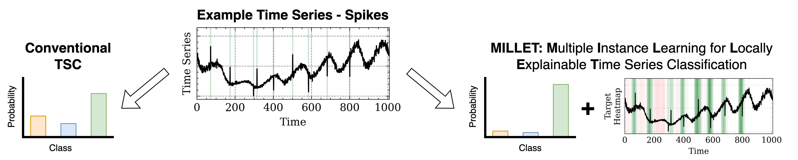

# SEA-Net guides

Everything you need to run, understand and extend this project. Read them in order the first
time; after that, jump straight to the one you need.

| # | guide | read it when |
|---|---|---|
| — | [Repository structure](#repository-structure) (below) | first day - what is where |
| 01 | [Environment setup](01_setup.md) | installing python, torch, the conda env |
| 02 | [Datasets](02_datasets.md) | getting UCR + WebTraffic onto the machine |
| 03 | [Running experiments](03_running_experiments.md) | training, evaluating, reproducing a result |
| 04 | [Configuration](04_configuration.md) | changing anything without touching Python |
| 05 | [Results](05_results.md) | what gets saved, where, and how to read it |
| 06 | [Adding an encoder](06_adding_an_encoder.md) | you have a new feature extractor |
| 07 | [Adding a MIL pooling method](07_adding_a_pooling_method.md) | you have a new aggregation head |
| 08 | [Adding a dataset](08_adding_a_dataset.md) | you have new time-series data |
| 09 | [MLflow](09_mlflow.md) | comparing runs; sharing one tracking system with Grid5000 |
| 10 | [Optuna](10_optuna.md) | hyperparameter search |
| 11 | [The MILLET baseline](11_millet_baseline.md) | running or understanding the baseline |
| 12 | [Grid5000](12_grid5000.md) | running on the cluster (Lille / Sophia) |
| 13 | [Debugging](13_debugging.md) | something broke, or you want breakpoints in VS Code |
| 14 | [Git](14_git.md) | branches and the commit workflow used here |
| 15 | [Voting pooling + the threshold](15_voting_pooling.md) | the new `voting` head and `confidence_threshold` |
| 16 | [The deployment bundle](16_deployment_bundle.md) | saving a model so it can go on an ESP32 |

---

## What the project is, in one paragraph

SEA-Net is a time-series classifier that is also **interpretable**: it does not only predict a
label, it also says *which timesteps* made it choose that label. It follows the MILLET idea
(Multiple Instance Learning for Time-series Classification): one series is a "bag", each timestep
is an "instance". We build our own small encoders and our own MIL pooling heads and compare them
against MILLET and the classic baselines (FCN, ResNet, InceptionTime). The goal is to beat MILLET
on **accuracy** and on **AOPCR** (the interpretability score) at the same time, with far fewer
parameters.

---

## Repository structure

```text
SEA_NET/
├── main.py                  the ONE entry point - read it to see the whole pipeline
├── configs/                 everything you can change without editing Python
│   ├── main.yaml               WHAT to run (model, dataset, seed, outputs, mlflow/optuna defaults)
│   ├── environments/           WHERE it runs: local.yaml, grid5000.yaml
│   └── models/
│       ├── baselines/          MILLET and the classic baselines
│       ├── seanet/             our encoder x pooling combinations
│       ├── ablations/          one-knob-at-a-time studies
│       └── top/                the SHORT LIST we keep - thin files that `extends:` the ones above
│
├── seanet/                  OUR code, one module per job
│   ├── config.py               load + merge the config layers
│   ├── data.py                 load a dataset by name
│   ├── preprocessing.py        normalise, and split train / validation
│   ├── models/
│   │   ├── encoders.py         every ENCODER + its registry
│   │   ├── pooling.py          every MIL POOLING head + its registry
│   │   └── build.py            wire encoder + pooling into one network
│   ├── training.py             the one training loop (+ the per-epoch history)
│   ├── evaluation.py           score a trained model -> one results row
│   ├── deployment.py           save/load a complete model (weights + config + ONNX)
│   ├── metrics.py              accuracy / balanced accuracy / AUROC / loss / AOPCR / NDCG
│   ├── results.py              save rows, resume a sweep, build the leaderboard
│   ├── interpretability.py     per-sample explanation figures
│   ├── analysis/               the cross-model comparison figures and tables
│   ├── tracking.py             MLflow - the single interface
│   ├── optuna_search.py        OPTIONAL search; it calls the same training pipeline
│   └── utils.py                device, seeds, run logging
│
├── millet/                  the MILLET BASELINE, upstream code kept unchanged
├── scripts/                 stand-alone utilities (profiling, ensembling, Grid5000 launchers)
├── data/                    the datasets (not in git - see guide 02)
├── results/                 all outputs (see guide 05 and results/README.md)
│   ├── old_results/            ARCHIVE - the finished 72-model sweep, never written to again
│   ├── top_results/            LIVE - where every new run writes
│   └── UCR/, WebTraffic/       NOT ours: MILLET's PUBLISHED numbers, read as inputs
├── guide/                   you are here
└── requirements.txt
```

### The three top-level code folders, and why the split matters

| folder | what it is | may I edit it? |
|---|---|---|
| `seanet/` | everything we wrote | yes - this is the project |
| `millet/` | the MILLET paper's own code, from their repo | **no** - keeping it byte-identical is what lets anyone diff this repo against theirs and see exactly what we changed |
| `scripts/` | utilities that are not part of a training run | yes |

MILLET is used in three places, all of them through a clear boundary:

1. **as a baseline model** - its encoders (`mil_inceptiontime`, `mil_fcn`, `mil_resnet`) and its
   pooling heads (`mil_conjunctive`, `mil_additive`, ...) are registered in our own registries
   under the `mil_` prefix, so they are selected by config exactly like ours;
2. **as the dataset base class** - `millet.data.MILTSCDataset` defines what a "bag" is;
3. **as the metric implementation** - AOPCR and NDCG come from
   `millet.interpretability_metrics`, so our numbers are directly comparable with the paper's.

Anything named `sea_*` is ours; anything named `mil_*` is theirs, reused unchanged.

---

## The pipeline, end to end

```text
configs/  ->  data  ->  preprocessing  ->  ENCODER  ->  MIL POOLING  ->  bag logits
                                                                        + interpretation map
                                                              |
                                       training loop  <-------+
                                            |
                                       evaluation  ->  metrics  ->  results row
                                            |                            |
                                          MLflow                     results.csv
                                                                         |
                                                                     analysis/
                                                              (leaderboard, comparisons)
```

Every arrow is one module, and `main.py` is the only file that knows the order.

### Where is the classification head?

Inside the MIL pooling head, on purpose. A MIL head must classify **every timestep** before it
aggregates them - that per-timestep class score *is* the interpretation map that AOPCR and NDCG
measure. Splitting the classifier out into its own module would break the interpretability, so
the honest picture is:

```text
encoder -> [ per-instance classifier + aggregation ] -> bag logits + interpretation
           \______________ the pooling head _______/
```

`seanet/models/pooling.py` names the linear layer that plays the classifier role in each head.

---

## The five commands you will actually use

```bash
python main.py models                                              # what can I run?
python main.py single Coffee --model seanet_bottleneck_topk --smoke  # 3-epoch flow check
python main.py single Coffee --model seanet_bottleneck_topk          # one real run
python main.py train  --model seanet_bottleneck_topk --env grid5000  # the full sweep
python main.py analyse                                             # rebuild every comparison
```

`python main.py -h` lists all of them.

---

## The architecture, in pictures

Three levels of detail, from the whole system down to one block:

| level | figure |
|---|---|
| 1 - the whole system |  |
| 2 - encoder and pooling |  |
| 3 - inside a block |  |

And the MILLET idea this builds on:


